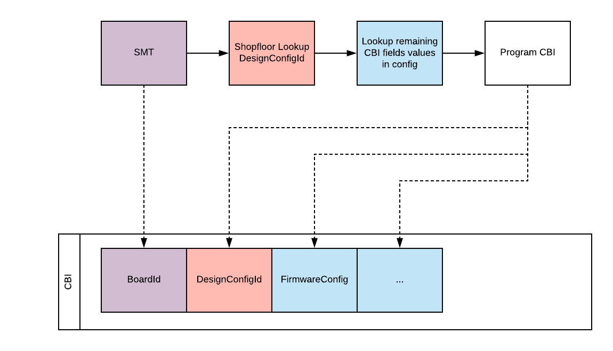

# Managing Hardware Design Configurations

[TOC]

## Background

Chrome OS firmware and software must change its behavior based on the hardware
present in a given system. For example, the presence of accelerometer sensors
affect how the EC firmware configures its tasks. The OS also uses the presence
of accelerometers to know whether it should enable tablet mode behavior.

We encode the expected hardware configuration in a way that firmware and
software can use. In past projects, this encoding has been done through resistor
straps or encoded in IDs programmed on an EEPROM (e.g. [CBI]).

Some hardware can be probed by firmware/software at runtime. For hardware that
is on a safely probeable bus, like USB or PCI (not I2C though), we allow the
device and driver to be probed. For example, we allow different cameras with
different drivers on a single design. However, the expected locations of cameras
on A/B/C/D panels should be encoded in the hardware configuration. Software
should still be resilient to HW failures (e.g. camera not responding) even if
the hardware configuration says to expect 2 A-panel cameras.

We define a list of hardware features that Google cares about, e.g. screen size
(driven by CTS requirements, etc.) or sensor presence (driven by firmware
configuration differences). We will call a unique combination of hardware
features a unique Hardware Design Configuration, and it will have a unique
Hardware Design Configuration ID (elaborated on later).

## Glossary

**SKU**: An overloaded term used within ODMs and Google differently. The SKU-ID
encoded in CBI and used in model.yaml is more fully known as the firmware sku
id. The firmware sku addresses the problem of differentiating meaningful
hardware differences needed by firmware and OS. The firmware sku id most closely
maps to Hardware Design Configuration Id. Futhermore, the SKU-ID field in [CBI]
will be repurposed to hold the DesignConfigId.

**Program**: high-level Chrome OS project for defining guidelines and
constraints for all design and projects within the program. Octopus is a
Program. Coral is another Program.

**Design Project**: maps to a single set of PDF schematics. Often referred to as
just a Design. For example, Phaser is a Design within the Octopus Program. This
also typically maps to a single PCB (not PCBA), but isn’t strictly required.

## Overview

We define a process for

*   Determining when to make a new Hardware Design Configuration Id. We will
    shorten this term to **DesignConfigId**.
    *   This is loosely analogous to the firmware sku concept in past projects
*   How the factory provisions the correct DesignConfigId in hardware during
    device assembly

## Hardware System Features

The current list of meaningful (to Google) system features lives in the
[hardware topology API](./hardware_topology.proto). For every meaningful
hardware feature (e.g. cameras), we want to track all of the meaningful
differences (e.g. “2 cameras” vs “1 camera”). Each meaningful variation of a
hardware feature is called a **Topology**.

In a general sense, a meaningful change for the purposes of hardware features
and hardware topologies is

1.  a user-visible difference
    1.  E.g. fingerprint sensor present versus not present
    2.  E.g. speaker placement (user visible and needed for different audio
        tuning parameters)
2.  a hardware difference that occurs on a non-probeable bus
    1.  E.g. presence of I2C sensors
    2.  E.g. which daughterboard is being used
3.  a hardware difference in bus topology
    1.  E.g. CNVi vs PCIe wifi module

A change that would not require a new hardware topology would be a hardware
change on a probeable bus, like PCI or USB. For example, changing the USB/PCI
camera out with a different camera would not be tracked by a different hardware
topology; this change would be tracked in Hardware ID (HWID) as a second sourced
component.

Each hardware feature defines what a meaningful permutation is to require a new
topology value. For example, the `screen` hardware feature defines that any
change in size, technology, or touch capability would require a new Topology
value. We have defined what is a meaningful change for each hardware feature in
the [hardware toplogy document](./hardware_topology.md).

Each Design (e.g. phaser within octopus) will define all of the valid possible
Topology options for each hardware feature within that Design. Each Topology
will also define a [human-readable description](./topology.proto#54) of that
Topology. This description may be used during the factory/RMA process with a
factory operator. All Topology values are only meaningful within the context of
a hardware feature (e.g. daughter board) within a particular Design (e.g.
phaser).

When an ODM is assembling a device, they will logically assert which hardware
topology is in use for each hardware feature we care about (more about that
process in the Factory Considerations section).

We group all of the hardware features that we care to track into a
[HardwareTopology](./hardware_topology.proto) object. If any physical device
built within a Design needs a different value for its HardwareTopology, then
that requires us to create a new
[HardwareDesignConfiguration](./design.proto#32), which has its own unique
[DesignConfigId](./design.proto#38). This DesignConfigId is what gets programmed
into CBI as the “SKU ID” going forward.

**In summary**, if there is any meaningful hardware change (meaningful is
defined per hardware feature) for any meaningful hardware feature (i.e. Google
is tracking it in HardwareTopology), then we need to create a new
HardwareDesignConfiguration which means there needs to be a new DesignConfigId.

### Adding new Supported Topology Values

If we need to add a new supported Topology value for a Design when we need to
express a new permutation (e.g. “2 camera with ARC support”) of a hardware
features (e.g. “cameras"), we should create a new topology value with helper
functions defined in [hw_topology.star](../../../../util/hw_topology.star).

Also we will allow a HardwareDesignConfiguration to change the topology values
until that configuration is used for a signed image build. Once a
HardwareDesignConfiguation has been used in a signed image, then it takes a
special override of the CQ to change a topology value (we might need to do this
for a backfill for a new hardware feature).

### Adding new Hardware Features we care about

As time progresses, Google and partners will care about more hardware features.
We will update the configuration APIs and backfill values of old projects (as
much as we can). The HardwareTopology and HardwareFeature objects are structured
in a way that allows Unknown as a possibility if we don’t have enough
granularity in previous project IDs to backfill with full fidelity.

## Factory Considerations

We have factory documentation detailing how to program hardware after the SKU-ID
(DesignConfigId) is known: [go/sku-id-in-eeprom]. We need to ensure that the
factory is capable of determining the correct DesignConfigId (SKU-ID).

Each unique DesignConfigId represents a unique set of Hardware Topology objects.
We expect each ODM’s shop floor to be able to give us the correct DesignConfigId
for each build. The factory process will also look up the FirmwareConfiguration
CBI values based on the DesignConfigId from the boxster configuration system
(e.g.
`chromiumos/src/project/<program>/<project>/generated/config.binaryproto`). See
below flow:

We should also have a factory verification step that ensures all hardware that
we can probe at runtime aligns with what the HardwareDesignConfiguration
hardware features says it is. For example, we should be able to probe for the
number of USB-C ports at runtime; we will verify this count with the number of
expected USB-C ports by the HardwareDesignConfiguration.

## RMA Considerations

RMA centers do not have access to the shop floor system. We have little choice
but to rely on manual operation input to select the correct hardware topology
values, e.g. touch vs non-touch for screen, for the design they are working
with.

Each Hardware Topology object has a description of what that selected topology
means. We can take the full list of all HardwareDesignConfiguration objects
under a Design (e.g. phaser within octopus) and determine which hardware
features have multiple valid hardware topology values. For all of the hardware
features with multiple values, we can display a question to the operator asking
the operator which topology is correct for the device currently getting
programmed. We keep asking questions until we know which
HardwareDesignConfiguration is in use.

[go/sku-id-in-eeprom]: https://docs.google.com/document/d/1EUhMNJKvyBP8v3MCDfPcsxf7uOz2LhU5QKLKKJbrkns
[CBI]: https://chromium.googlesource.com/chromiumos/docs/+/HEAD/design_docs/cros_board_info.md
