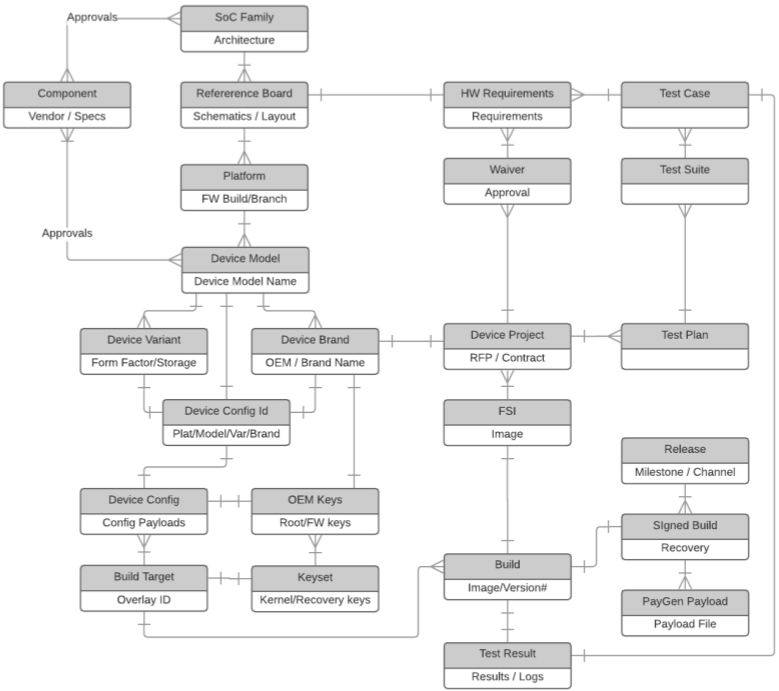
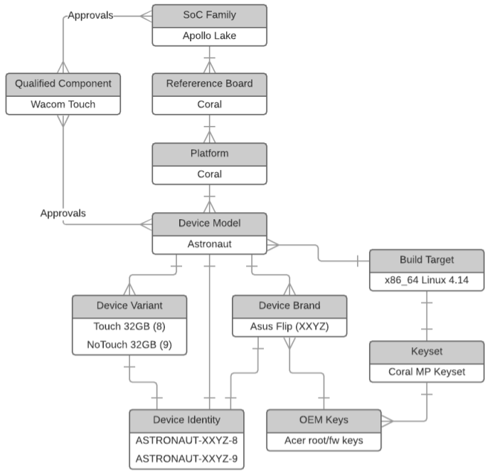
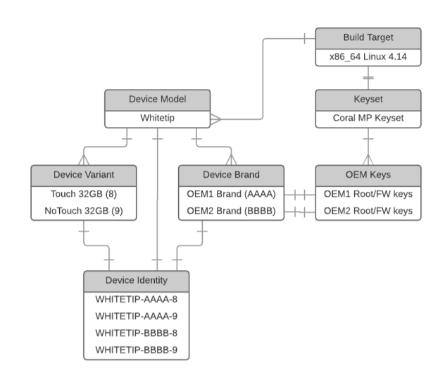

# Entity Definitions
This section defines all of the core entities of the ChromeOS domain model.
Terms are loosely grouped into categories based on where the terms are the most
prevalent.

## Business Entity Definitions
__Form Factors__:  Form Factors are high level classification for the
devices that ChromeOS supports. The current supported form factors are
(chromebooks, convertible, detachable, chromeslate, chromebox and
chromebase). Old form factors are chromebit.
Please refer
[here](https://www.google.com/chromeos/partner/fe/docs/latest-requirements/formfactors.html)
for details on each form factor.

__Hardware Requirements__: Hardware Requirements are requirements defined
for each form factor and have to be met by devices that are certified by
Google. The requirements are snapshot and versioned (usually for each RFP
cycle) and shared with partners (OEMs, ODMs etc) on ChromeOS partner site.
Latest requirements (master branch) are published
[here]( https://www.google.com/chromeos/partner/fe/docs/latest-requirements/chromebook.html)
and maintained under git
[here](https://chrome-internal.googlesource.com/chromeos/requirements#).

__Reference Design (Kit)__: Reference Kits are provided to each OEM who
wants to build a Chrome device.  The kits includes schematics (PDF), board
layout files (BRD), initial BIOS/EC, as well as the approved BOM, and are an
actual deliverable used to kickoff a project.

__RFP__: Twice a year ChromeOS PEng team sends out 'request for proposal'
to OEM partners that introduces the new reference designs for ChromeOS
device form factors that Google is working, and OEMs can respond
with proposals to build devices based on these platforms.

__HWID Config/Database__: A config file/definition that defines all the
parts that are approved for a particular device and actually used. A single
config can result into several combinations of parts. Each unique
combination creates a unique pattern called __HWID (String)__.

__SoC Family__: These are the major releases from chip manufacturers,
loosely defined as a unique silicon die, which subsequently drive Reference
Board designs and the overall product roadmap.

__Architecture__: This is the Instruction Set Architecture (ISA) implemented
by a given SoC Family (e.g. x86_64, ARM, etc…).

__Platform__: This is name (set in the AP-RO firmware) that uniquely
identifies the firmware build branch supporting a given set of device
projects.

__Device Model__: This is a unique implementation of a Reference Board design based on the following criteria:
*   ODM
    *   different ODM implies different layout/manufacturing process and
    potentially schematic
*   Significant Form Factor Variation
    *   Detachables/Boxes/Clamshells/Convertibles get unique models
*   Screen size

    *   11” and 14” devices are different models
*   Different MIPI camera specs
    *   USB cameras which have less software dependence are exempted
*   Software Critical Component Variation
    *   Anything outside of the reference design component guidelines.
    *   Different connectivity (LTE/WiFi), EC, PMIC, display interface, etc.

__Device Model Name__: This is a unique identifier set on a per model basis,
which is read via mosys/cros_config in order to make runtime decisions about
configuration usage.

__Device Variant (aka Device SKU previously)__: This is every unique
specification configuration that will be manufactured for a given Device Model.

The following defines the criteria for different device variants.
*   SoC speed grade
    *   e.g. Celeron vs. i5, but all with the same SoC die, e.g. all SkyLake-Y
*   RAM capacity
*   Storage capacity
*   Touch screen presence and capabilities (e.g. stylus)
*   Keyboard backlight
*   Ambient Light Sensor (ALS)
*   Speaker and mic configuration
*   Chassis cosmetics
    *   e.g. color/finish/decals/etc.

For example:
*   Touch=Yes, Stylus=Yes
*   Touch=Yes, Stylus=No
*   Touch=Yes, Stylus=No

This is most aligned to the previous concept of SKU, but SKU is sufficiently
conflated across so many projects and different workflows that we’re decoupling
from SKU.

__Device Brand__: This is the information that makes a device uniquely
recognizable to an end user.  There is some type of marketing name users will
recognize and this is generally the level at which we sign devices for
verified boot.type:docs

__Device Config Identifier__: This is a globally unique identifier that
determines what set of configuration data is used for a given device.

Currently, this identifier is composed of the following:
*   Platform (source: ‘mosys platform name’)
*   Model-name (source: ‘mosys platform model’)
*   Device-variant (source: ‘mosys platform sku’, aka Device-SKU)
*   Device-brand (source:  ‘mosys platform brand’, aka RLZ-code)

__Device Project__: A project is a mechanism to track development phases
(Proto, EVT, DVT, PVT) for an OEM device or a reference device (Google may
build a reference device to prove a reference design even without a OEM. We
will have a project to track it). One project only tracks one device, but not
all devices have a project (For example LOEM devices made on white label
devices don’t have a project except for the original white label project).

__Component__: These are individual components (memory, camera, display panel,
battery, etc…)  that are plugged into a given board over various interfaces,
or part of the board design. MLB components may be second sourced on the PCB
(eg, emmc, dram), or require board modification. System components are not
part of the board design/layout itself and are sourced from external vendors
(eg. USB camera, display).  Based on cost, availability, and other reasons,
ODMs generally want more than one supplier of each respective component.

__Component Identifier__: This is a unique identifier for a given component
that is used across the architecture to reference a given instance of a
component.

__Qualified Component__: This is a specific component from a given vendor that
has met Google’s minimum quality standards for a given SoC Family.
Partners are required to complete component qualification testing before
components can be used with a given SoC Family.  For context, see Component
Qualification and AVL.

## Build/CI Definitions

__OEM Keys__: These are OEM specific root and firmware signing keys are
generated on a per OEM basis.  The root key is set during manufacturing and
starts the trust chain for verified boot.

__Keyset__: This is a unique set of keys managed in the signer infrastructure
that are used to sign a given image.  A keyset shares the kernel and recovery
keys, but allows root and firmware keys to be managed on a per OEM basis.

__Device Config__: This is the payload of configuration data that is managed in
given overlay’s config ebuild and deployed to the device image as part of the
build process.

__Build Target__: This is a distinct portage build target that is used to
generate builds.

__Build Image__: This is a unsigned binary image that can be deployed on a
ChromeOS for development/testing purposes.

__Signed Build Image__: This is an image that has been signed (with official
production or dev keys), making it a valid image to support secure verified
boot.

__Payload__: This is a signed binary differential that can be applied to a
system based on the auto-update feature.

## Test Definitions

__Test Case__: This is a atomic unit of testing that can be executed as a unit
test, on a VM, or on live hardware.

__Test Suite__: This is a collection of test cases. A given test case may
belong to many test suites.

__Test Plan__: This is a collection of Test Suites to execute and a set of
rules that dictate specific coverage requirements for a given Project.

## Release Definitions

__Release__: A release is a set of builds for a given milestone and channel
which are pushed to devices, typically through Omaha.

__Final Shipping Image (FSI)__: This is a specific build image that is used as
the final image deployed to device during the manufacturing process.  There
will be several FSIs for a given device over the manufacturing lifetime of the
device.

## Factory Definitions

__Manufacturing Phases__: These are the different phases (Proto, EVT, DVT, PVT)
that devices are manufactured during a given project (for details, see
[Partner Expectations Terminology](https://www.google.com/chromeos/partner/fe/docs/getting-started/partnerexpectations.html)
). During development, devices are commonly referred to based on which phase
they were produced.

__RMA (Return Merchandise Authorization)__: This is the process executed when
users return devices for repair/replacement (for details, see
[RMA Requirements](https://www.google.com/chromeos/partner/fe/docs/rma/rmareqs.html)
).

__Vital Product Data (VPD)__: VPD (specifically RO VPD) is set during
manufacturing and can be used to control software behavior at runtime based on
various settings.  For example, VPD is used to differentiate Whitelabel
Devices, which dictates with root and firmware keys should be used at runtime.
For context, see
[VPD Specifications](https://www.google.com/chromeos/partner/fe/docs/factory/vpd.html).

__Factory Line__: TBD

# Entity Relationships

This section demonstrates how the domain model actually fits together based on the respective relationships.

## Entity Schema
Based on all of the entity definitions, this a logic view of the relationships
and plurality of the high level entities in the domain.

## Coral Device Example

Based on the schema, this is a simple example of one device in the Coral project
definition.

Additionally, this is an example of Coral white-label implementation:

## Richer Domain Model Example
The Workflow section of [this architecture document](http://go/cros-infra-arch)
has a richer example of this domain model and how the information would actually
flow through the architecture.
