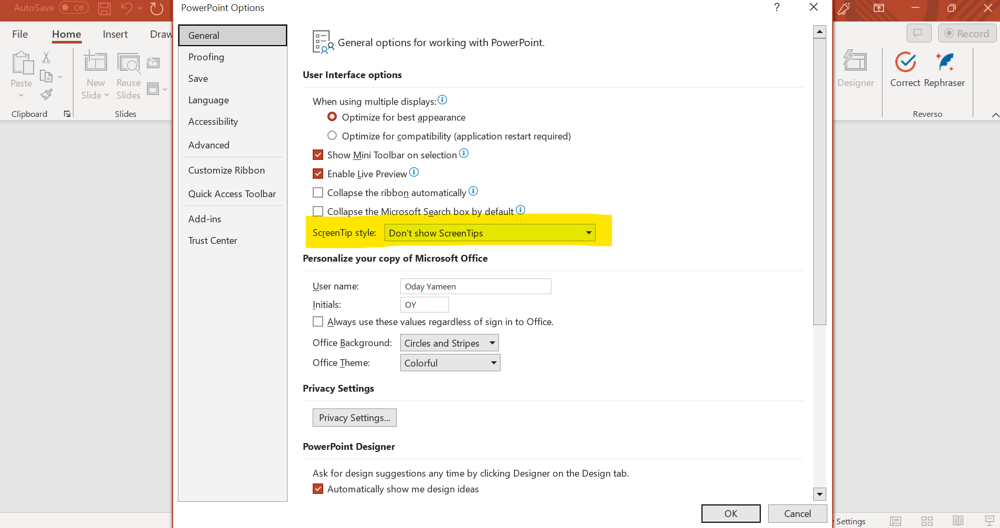

# GoogleBenchmarking

## Description

The Google Benchmarking project comprises Python scripts designed to
execute various use cases and scenarios on a computing system. Additionally,
certain
scripts are tailored to conduct measurements, including time measurements,
pertinent to these use cases. This project is compatible with both ChromeOS
and Windows operating systems, ensuring versatility across different
computing environments.

Furthermore, the automation code within the project supports two major web
browsers for the Windows operating system: Google Chrome and Microsoft Edge.
This enables users to conduct benchmarking and automation tasks seamlessly
across these browsers, enhancing the project's utility and applicability in a
broader range of scenarios.

## Prerequisites for Windows:

1. Python and pip installed on the local
   machine. [[Python Installation Steps](#python-installation)]

2. Installation of required Python packages using the provided requirements
   file.
3. Installation of required Chrome Driver for Google Chrome browser.
   [[Google Chrome
   Driver Installation Steps](#chromedriver-installation)]
4. Installation of required Edge Driver for Microsoft Edge browser.
   [[Microsoft Edge Driver
   Installation Steps](#edgedriver-installation)]
5. For running native apps on Windows we need to have the following:
    - Install WinAppDriver for native app
      testing. [[WinAppDriver Installation Steps](#winappdriver-installation)]
    - Install Microsoft Office\root\office16 that's compatible with the
      one in the ```constant.py``` file, for
      example: ```C:\Program Files\Microsoft Office\root\Office16\EXCEL.exe```
    - Once native desktop office app installed, open the 
      applications only for first time, for example Excel, Word,
      PowerPoint, and make sure to have ```ScreenTip style```
      option equal to ```Don't show ScreenTips``` by navigate
      to File menu -> Options -> General -> ScreenTip style.
      
4. Add the testing email and password that will be shared with you in .env file.

5. To run the code on Windows. You need to add the project to environment paths:
    - create a user variable named ```PYTHONPATH``` with the absolute path of
      the project on your local machine as its value.

### <a id="python-installation"></a>How to install Python and PIP on Windows?

1. You need to install Python 3.12.0. You can follow the link below for Windows
   64-bit:
   ```https://www.python.org/ftp/python/3.12.0/python-3.12.0-amd64.exe```
2. Run the installer executable file.
3. Select ```Add python.exe to PATH```.
   - Choose ```Customize installation``` and ensure that all the options are
       selected (the default), then press ```Next```.
4. Select ```Install Python 3.12 for all users``` and then press the
   ```Install``` button.
5. Once the installation is complete, press the ```Close``` button.
6. Verify the Python version by executing the command ```python --version```
   in the command prompt; it should return ```Python 3.12.0```.

### <a id="chromedriver-installation"></a>How to install Google Chrome Driver?

1. To install the Chrome driver. You can follow the installation link below:

   ```https://googlechromelabs.github.io/chrome-for-testing/```
2. Install the compatible version with your Google Chrome browser. You can
   check your Google Chrome browser by opening the browser:
   ```Help -> About Google Chrome```
3. Extract the compressed file then move the executable file to your Local
   Disk (C:) ```C:\chromedriver.exe```.

### <a id="edgedriver-installation"></a>How to install Microsoft Edge Driver?

1. To install the Edge driver. You can follow the installation link below:

   ```https://developer.microsoft.com/en-us/microsoft-edge/tools/webdriver/```
2. Install the compatible version with your Microsoft Edge browser. You can
   check your Microsoft Edge browser by opening the browser:
   ```Help and feedback -> About Microsoft Edge```
3. Extract the compressed file then move the executable file to your Local
   Disk (C:) ```C:\msedgedriver.exe```.

### <a id="winappdriver-installation"></a>How to install and Run WinAppDriver for Windows?

1. To install the WinAppDriver. You can follow the installation link below:
   ```https://github.com/microsoft/WinAppDriver/releases/download/v1.2.1/WindowsApplicationDriver_1.2.1.msi```
2. Enable Windows Developer mode from settings -> Update & Security -> For
   developers -> Developer mode.
3. To execute the native application tests then you need to run the
   ```WinAppDriver.exe```.
4. Navigate to the Windows Application Driver directory and double-click the
   file ```WinAppDriver.exe``` to run it.

## Prerequisites for ChromeOS:

1. Install ChromiumOS testing image and enable developer mode on your device.
   You can follow the steps by links below:
   - ```https://www.chromium.org/chromium-os/developer-library/guides/development/developer-guide/#installing-chromiumos-on-your-device```
   - ```https://www.chromium.org/chromium-os/developer-library/guides/debugging/debug-buttons/```
2. Run the following commands from chronos terminal that opened by ctrl + alt + ->:
    - sudo /usr/share/vboot/bin/make_dev_ssd.sh --remove_rootfs_verification --force
    - reboot
3. Add the following environment variables to ~/.bashrc file:
   - note `PYTHONPATH` should have absolute path to the project on your local machine.
       ```
       export PATH="$HOME/.local/bin:/usr/bin:$PATH"
       export PATH=$PATH:/usr/local/bin
       export PYTHONPATH="<absolute path to the project>"
       ```
   - execute ```source ~/.bashrc``` after adding them.
4. Verify that default testing image python installed is python3 version 
   by use this command ```python3 --version```
   and to install pip use this command
   ```python3 -m ensurepip```
5. Install required packages from requirements.txt by this command 
```python3 -m pip install -r requirements.txt```
6. Verify testing image has chromedriver in correct location that in ```/usr/local/chromedriver/chromedriver```
7. Add testing email and password to .env file
8. Do the following steps:
   - (as `root`) Add ```--remote-debugging-port=9222``` at the end of /etc/chrome_dev.conf.
   - Reboot
   - (as `chronos`) Run ```netstat -al | grep 9222``` and make sure `localhost` is listening. 
9. Before run any use case, ensure that all browser extension is disabled and
no applications is opened rather than croshell to run the tests.
## Usage:

1. Clone or update the chromium code to your local machine.
2. Navigate to the project directory (cros_ca).
3. Install the required packages by running:
    ```doctest
        pip install -r requirements.txt
    ```
4. Run the automation code from Windows terminal (check the available tests
   [[Tests List](#available-tests)]) , 
   for example:
    ```doctest
        python automated_use_cases\excel\excel_google_web.py
    ```
5. To Run the web automation code using ```Microsoft Edge``` instead of the
   default behavior that will open Google Chrome from Windows terminal:
    ```doctest
        python automated_use_cases\load_cnn\load_cnn.py edge 
   ```
6. Run the automation code from ChromeOS terminal (check the available tests
   [[Tests List](#available-tests)]) , 
   for example:
    ```doctest
        python3 automated_use_cases/excel/excel_google_web.py
    ```
7. To Run the web automation code using ```Microsoft Edge``` instead of the
   default behavior that will open Google Chrome from ChromeOS terminal:
    ```doctest
        python3 automated_use_cases/load_cnn/load_cnn.py edge 
   ```
## <a id="available-tests"></a>Tests List

We can run a single test for each command, with the test script names provided
in the list below:

1. Windows and ChromeOS platform:
    - browse_four_website.py
    - excel_google_web.py
    - excel_microsoft_web.py
    - load_cnn.py
    - load_speed_test.py
    - pdf_web.py
    - ppt_google_web.py
    - ppt_microsoft_web.py
    - word_google_web.py
    - word_microsoft_web.py

2. Windows platform: 
    - excel_native_desktop.py
    - ppt_native_desktop.py
    - word_native_desktop.py
    - windows_photo.py
    - windows_video.py

## Notes

- The native automation code designed to be run on the Windows devices.
- Ensure that your Google Chrome and Microsoft Edge browsers are updated
  before running the code. This will make it easier to find the compatible 
  webdriver in the recent versions.
- Testing email and password will be same for Google and Microsoft web
  use cases.
- When running native automation code, ensure that the application used in
  test is closed before running it.
- For Windows Video recording use case, ensure there is no other windows
  application is opened on screen, rather than the CMD to run the use case,
  to avoid recording other windows application, because it is designed to
  record YouTube browser tab.
- In case of using different email and password in .env file, make sure
  to use free subscription for MS Office 365, for example having gmail 
  account to be able to run Google Web use case, and create MS Office 365
  account with it, because Microsoft Web use cases are designed to run on
  free subscription.

## Remaining Enhancements

1. Create a script that will automate the possible steps from the
   prerequisites such as installing python/pip.

## Code Formatting and Analysis:

- The project code is formatted using the Black formatter to ensure
  consistency and readability.
- Pylint is utilized as a static code analyzer to maintain code quality and
  identify potential issues.