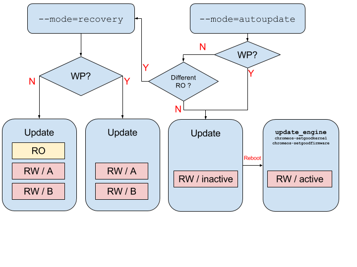

# ChromeOS Firmware Updater

This repository contains the firmware updater (`chromeos-firmwareupdate`) that
will update firmware images related to verified boot, usually host (also known
as AP or MAIN) and EC (Embedded Controller).

[TOC]

## Introduction

Auto update is one of the most important feature in Chrome OS. Updating
firmware is one of the most complicated process, since all Chromebooks come
with firmware that implemented [verified
boot](https://www.chromium.org/chromium-os/chromiumos-design-docs/verified-boot)
and must be able to update in background silently.

## Using Firmware Updater

The firmware updater was made as an self-extracting archive with firmware
images, updating logic, even utility programs.

> In all modes, updater will try to preserve a list of known firmware data, for
> example the VPD sections (`RO_VPD`, `RW_VPD`), and components in `GBB` section
> like `HWID`.

### Update manually

Usually you can find the updater in `/usr/sbin/chromeos-firmwareupdate`
on a Chrome OS device (or the rootfs partition of a disk image).

To look at its contents (firmware images and versions) in machine friendly way:

```bash
chromeos-firmwareupdate --manifest
```

Currently we also support a human readable form:

```bash
chromeos-firmwareupdate -V
```

Usually for people who wants to "update all my firmware to right states", do:

```bash
chromeos-firmwareupdate --mode=recovery
```

> The `recovery` mode will try to update RO+RW if your write protection
> is not enabled, otherwise only RW.

If your are not sure about write protection status but you only want RW to be
updated, run:

```bash
chromeos-firmwareupdate --mode=recovery --wp=1
```

> The `--wp` argument will override your real write protection status.

If your want *everything* (RO and RW) to be updated and would like the updater
to check WP state for you:

```bash
chromeos-firmwareupdate --mode=factory
```

### Simulating ChromeOS Auto Update

The ChromeOS Auto Update
([`update_engine`](https://chromium.googlesource.com/aosp/platform/system/update_engine/+/HEAD/README.md))
runs updater in a different way - an A/B update.

If you want to simulate and test that, do:

```bash
chromeos-firmwareupdate --mode=autoupdate --wp=1
```

## Building Firmware Updater

The updater is provided by the
[`virtual/chromeos-firmware`](https://chromium.googlesource.com/chromiumos/overlays/chromiumos-overlay/+/HEAD/virtual/chromeos-firmware)
package in Chromium OS source tree, which will be replaced and includes the
`chromeos-base/chromeos-firmware-${BOARD}` package in private board overlays.

To build an updater locally, in chroot run:

```bash
emerge-${BOARD} chromeos-firmware-${BOARD}
```

If your board overlay has defined USE flags `bootimage` or `cros_ec`,
`chromeos-firwmare-${BOARD}` package will add dependency to firmware and EC
source packages (`chromeos-bootimage` and `chromeos-ec`), and have the firmware
images in `/build/${BOARD}/firmware/{image,ec}.bin`.

> In other words, you can remove `bootimage` and `cros_ec` in branches that you
> don't need firmware from source, for example the factory branches or ToT,
> especially if there are external partners who only has access to particular
> board private overlays. To do that, find the `make.conf` in board overlay and
> add `USE="-bootimage -cros_ec"`.

## Manipulating Firmware Updater Packages

The firmware updater packages lives in private board overlays:
`src/private-overlays/overlay-${BOARD}-private/chromeos-base/chromeos-firmware-${BOARD}/chromeos-firmware-${BOARD}-9999.ebuild`.
Find a template here in [chromiumos-base/chromeos-firmware-null](https://chromium.googlesource.com/chromiumos/overlays/chromiumos-overlay/+/HEAD/chromeos-base/chromeos-firmware-null/chromeos-firmware-null-9999.ebuild).

Usually there are few fields you have to fill:

### CROS_FIRMWARE_MAIN_IMAGE

A reference to the AP firmware image, which usually comes from
`emerge-${BOARD} chromeos-bootimage` then `/build/${BOARD}/firmware/image.bin`.

Usually this implies both RO and RW. See `CROS_FIRMWARE_MAIN_RW_IMAGE` below for
more information.

> You have to run `ebuild-${BOARD} chromeos-firmware-${BOARD}.ebuild manifest`
> whenever you've changed the image files (`CROS_FIRMWARE_*_IMAGE`).

### CROS_FIRMWARE_MAIN_RW_IMAGE

A reference to the AP firmware image and only used for RW sections.

If this value is set, `CROS_FIRMWARE_MAIN_IMAGE` will be used for RO and this
will be used for RW.

### CROS_FIRMWARE_EC_IMAGE

A reference to the Embedded Controller (EC) firmware image, which usually comes
from `emerge-${BOARD} chromeos-ec` then `/build/${BOARD}/firmware/ec.bin`.

## Technical Details

### Packaging

The firmware updater is built by running `pack_firmware.py`, which collects
firmware image files, and then archived in ZIP format with a special bootstrap
SFX script `pack/sfx2.sh`.

For details about package format, check [pack/README.md](./pack/README.md).

#### Run unit tests

Before submitting changes to `pack_firmware.py`, please run the unit tests.

```
cros_sdk --working-dir=/mnt/host/source/src/platform/firmware -- python3 -m unittest *_unittest.py *_functest.py
```

### Updater logic

Here's a detailed list of how each updater mode works:



 - `--mode=autoupdate`: Invoked by `update_engine` when a payload is installed.
   1. Check if WP is enabled.
   1. If WP is enabled, update RW / inactive and exit. After system reboot.
      The `update_engine` will invoke `chromeos-setgoodfirmware` after 60 secs,
      which will update or mark booted RW firmware to active.
   1. If WP is disabled, check if the RO section is same as
      `CROS_FIRMWARE_MAIN_IMAGE`. If yes, go 2. Otherwise, do `--mode=recovery`.

 - `--mode=recovery`: Invoked by recovery shim after installed.
   1. Check if WP is enabled.
   1. If WP is enabled, update both RW/A, RW/B and exit.
   1. If WP is disabled, update whole image except preserved sections like VPD.
      This includes RO, RW/A, and RW/B.
> Note in `recovery` mode, the `HWID` and flags in `GBB` are both preserved.

 - `--mode=factory`: A special recovery mode for factory initial imaging that
   always runs as `wp=0` and *NOT* preserving GBB flags.
   1. Check if WP is enabled, and exit with failure if enabled.
   1. Update whole image except preserved sections like VPD.
      This includes RO, RW/A, and RW/B.
> Note in `factory` mode, in addition to preserved sections, the `HWID`
> in `GBB` will also be preserved. Other `GBB` data (root key, recovery key,
> flags) will be changed. The `GBB` flags must be changed because in factory
> process we need to overwrite the flags so we can ensure developer mode or
> other factory friendly settings being turned on in the first boot.

 - `--mode=legacy`: A special mode that only updates `RW_LEGACY`.

 - `--mode=output`: A special mode for updater with multiple sets of images.
   1. Collect system information like model and custom label tags.
   1. Apply patches like signing key blocks if available.
   1. Write images to given output folder (`--output_dir`).
