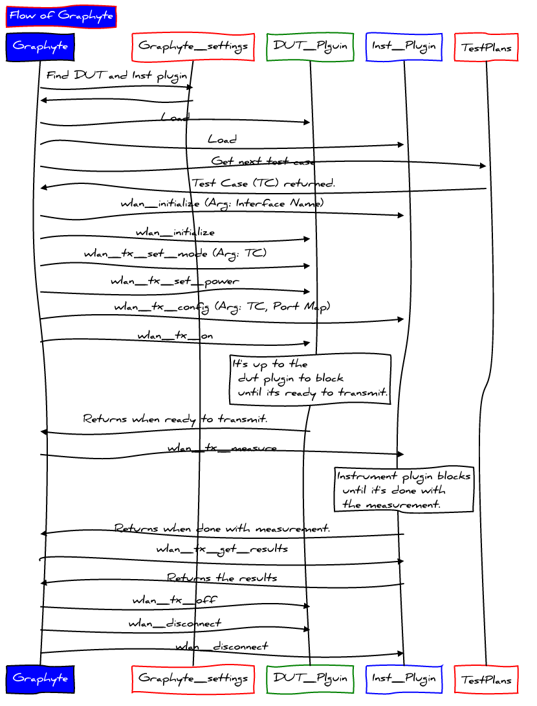

# Google Radio Phy Test Framework

## Overview
Graphyte (Google RAdio PHY TEst) is a Python based software framework for the
calibration and verification of wireless connectivity radios in design and
manufacturing. It is designed with an open, extensible architecture enabling
wireless silicon and instrumentation vendors to develop their own plugins for
PHY calibration and verification. The initial focus is on Wi-Fi and Bluetooth
with 802.15.4 on the horizon.

Please refer to the [user manual](https://groups.google.com/forum/#!topic/graphyte-public/GJgiDc482K8)
for more details.

## Build
No build step is required.

## Install
Two options:

    $ (sudo) make install
or

    $ (sudo) pip install .

## Uninstall
    $ (sudo) pip uninstall graphyte

## Distribution
1. Create a tarball by: make dist
   The tarball can be found under the folder 'dist'
2. Copy the tarball to target machine
3. Extract the tarball
4. Inside the extracted folder, type the command to install:

        $ (sudo) pip install

## User manual
Please find the user manual [here](https://groups.google.com/forum/#!topic/graphyte-public/GJgiDc482K8)
for more details.

## Interactive shell
An interactive shell is also implemented to analyze the interactions
between a DUT and an instrument step by step.

Follow these steps to start the interactive shell:
1. Install the graphyte framework and necessary plugins.
2. Follow the user manual to create a valid config file.
3. Run the interactive shell by:

    $ python -m graphyte.plugin_shell path/to/config/file
