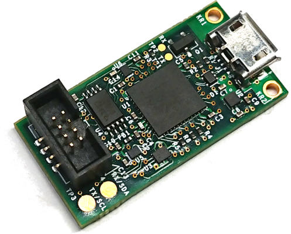
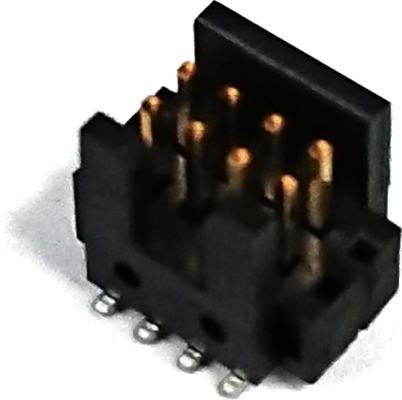
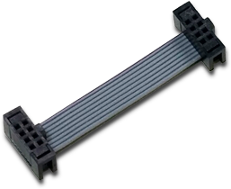
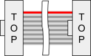

# C2D2: Case-Closed Debugging Debugger



[TOC]

## What it is

A minimal debugging tool designed to fill in the gaps and support boards
that depend on Case-Closed Debug via GSC for system debug and bringup.

## What it is not

**C2D2 is not Servo**.  C2D2, when combined with a robust implementation
of CCD, is a viable replacement for  the Servo header, but C2D2 alone
is not intended to be The Next Servo.

## Features

* [EM100-compatible][EM100] header for fast AP firmware development with
  [no adapters needed][EM100-Connector].
* GSC reset and UART access for debugging CCD
* EC UART/I2C access for flashing EC firmware and debugging CCD
* Power button control for automating GSC unlock and enabling FAFT tests
* Independent reference voltages for SPI, GSC, and EC UART
* Hot-pluggable -- won’t reset the system on attach
* Keyed, robust connector that is smaller than the Servo V2 header and
  can be placed in the middle of the board to maximize SPI speeds
* Large UART/I2C pads (on C2D2 Micro) for custom needs
* Inexpensive design, COTS connectors and cabling

## Features not included

* Unpowered board flashing.  This rarely worked with the Servo V2
  header and creates many leakage paths and adds hard-to-remove expenses
  to the DUT.
* EC reset independent from GSC reset.  GSC reset will always trigger EC
  reset.  EC reset can be independently triggered via the GSC UART console.
* AP UART.  We depend on CCD or SSH for this.  C2D2 is optimized for
  getting CCD debugged and stable quickly, and not for all-purpose system
  debug.  See [What it is not](#what-it-is-not)
* Button emulation other than the power button.  Use the EC console to
  emulate buttons.
* JTAG.  Generally, SoC manufacturers have required their own debugging
  header.

## C2D2 Connector


The `MUX_UART_ODL` pin controls whether the C2D2 header behaves as a
SPI header (for reading/writing to SPI Flash via servod/flashrom OR
for direct connection to the EM100, where this is the `WP_L` pin),
or whether it exposes the UARTs/I2Cs and reset/power button signals.
Shorting this pin to ground will select the UART/I2C/IO pinout, and
leaving it floating will retain the SPI mode.

The connector itself is a standard 1.27mm-pitch 2x4 pin connector
with IDC-compatible shroud, commonly available in China (e.g.,
[Amphenol G22F2041000S1HR][Amphenol G22F2041000S1HR], [JILN
3230-08-M-G0-C-B-K00-P-01][JILN 3230-08-M-G0-C-B-K00-P-01]) but a
little harder to get in the USA. JILN provided samples on request in the past,
and sometimes their parts can be found on Amazon or other redistributors.



Samtec also makes a connector that is a middle ground between the lower
profile of the unshrouded connector and the keying+protection afforded by
the shrouded version.  The part number is [ASP-215440-01][ASP-215440-01].
You can also get the 12-pin version and manually remove the outer
column pins.

## C2D2 Cables

Since it’s standard 0.635mm-pitch ribbon wiring going to standard
1.27mm-pitch IDC connectors, there are several options for getting
cable assemblies.



Compatible with the 1.27mm-pitch 2x4 cables included with the EM100 and
orderable as accessories on the Dediprog site in [8cm][8cm cable] and
[2.5cm][2.5cm cable] lengths.  Dediprog is willing to set up bulk orders
if you talk to them.



Since the cables are standard IDC, you can easily assemble your own keyed
cables of any length using raw cabling and IDC connectors (using pliers
or careful application of a hammer).  Both are available on Amazon in
[10ft rolls of cabling][10ft cable] and [10pc packs of connectors][10
connectors].  Digikey also has [connectors][Digikey connectors] and
[cabling][Digikey cables].  **The two connector keys and the red wire
should match up as in the drawing.**

For UART traffic, any length will work -- even 250cm.  If you need SPI
programming functionality, you want 15cm or less (8cm is a sweet spot).
If you want SPI emulation functionality with an EM100, go with the 2.5cm
cable (or shorter!).

Long cables left attached to the DUT with nothing asserting the
`MUX_UART_ODL` signal (e.g., detached or unpowered C2D2 micro) will
break SPI boot traffic.

Many ODMs are also equipped to build simple ribbon cables like these.

## C2D2 DUTs

Due to the high clearance of the cable, the C2D2 connector can be placed
in the center of the board to minimize SPI stubs.  The cable routes out in
the direction of the shroud keying (the side with the odd-numbered pins).
A cut-out in the D panel is almost certainly necessary if the header is
to be used in-chassis.

DUT circuitry is generally just the [header](#c2d2-connector) and a MUX
([TS3A27518E][TS3A27518E] recommended), although if the GSC or EC UART
voltages vary or the EC is reflashed via I2C, additional components may
be necessary (1-2x NFETs or 1x 2:4 mux, respectively).  See [C2D2 DUT
schematics][C2D2 DUT schematics] for details.

### GSC/CCD

Since CCD is now the primary debug interface for the system, great
care must be taken during the hardware design process to ensure it
works reliably.

* Start from an existing C2D2-based design for GSC and C2D2
    * Compare deltas from the [H1 appnote schematics][H1 appnote
      schematics] and ensure you understand the changes
    * If the H1 or EC interfaces are not 3.3V, ensure the correct VREF
      FETs are used
* Carefully go through [H1 system design notes][H1 system design notes]
  to ensure you do not repeat mistakes
    * In particular, ensure you have `LID_OPEN` (or `RECOVERY_ODL`)
      hooked up to GSC to cover FAFT requirements
* Provide (and document) simple bypasses to ensure CCD is accessible
    * Provide a `CCD_MODE_ODL` override jumper to ground to force-enable
      CCD
    * Add stuffing options to isolate the Type-C SBU pins from the rest
      of the system, with an IC-free path to GSC's USB
    * On I2C-flashed ECs, provide an override jumper to force the mux
      into the I2C position
    * Provide clearly-marked AP UART test points; in a pinch these can
      be jumped to C2D2 Micro
* Sync up with the GSC team on the schedule for your first protos;
  someone from the team will need to be on-call to support getting CCD
  up and running when you get first boards.
    1. When you start working on the schedule, do one of the following
       to allocate time from somebody in GSC team during bringup:
        * email chromeos-gsc@ with the request;
        * file a Buganizer bug: http://go/new-cros-dt-bug

## C2D2 Micro

C2D2 Micro (G650-05194-00) adapts the C2D2 interface to USB2.0,
just like Servo Micro.  The 4-layer board is 15mm x 30mm and has a
relatively low number of simple-to-SMT components, making it cheap and
easy to mass-produce.  The bottom of the board is entirely covered in
soldermask to eliminate shorting risk.

C2D2 Micro is programmed in the same way as [Servo Micro][Servo Micro
firmware], using OTG and A-to-A USB cables
(but with `BOARD/--board/-b c2d2`).

Also see [schematics][C2D2µ schematics], [layout][C2D2µ layout] and
[STM32 pin-out doc][C2D2µ pin-out] (internal only).

Usage guides:

* [Flashing an EC using C2D2 Micro (go/c2d2-ec)](https://goto.google.com/c2d2-ec)
* Other info may be available in [go/c2d2](https://goto.google.com/c2d2)

## Updating Firmware {#updating-firmware}

The latest firmware is available via the servod docker image. You need to have go/servod
configured. That would also add servo_updater CLI to your host shell.

<!-- mdformat off(b/139308852) -->
*** note
**NOTE**: [`servod`] must not be running. You should have recent versions of
start-servod and servo_updater scripts that are in hdctools repo (repo sync)

***
<!-- mdformat on -->

**Update to latest stable firmware:**

```bash
(HOST) $ servo_updater -- -b c2d2
```

**Rollback to previous stable version if needed:**
```bash
(HOST) $ servo_updater -- -b c2d2 -c prev --allow-rollback
```
---
Advanced usage below:

- Update to specific binary file

```bash
(HOST) $ servo_updater -f <file_path> -- -b c2d2
```

- Update to specific FW channel

```bash
(HOST) $ servo_updater -- -b c2d2 -c [alpha|dev|prev|stable]
```

- If you need to update FW, before it reaches monthly released servod image specify
channel for servod docker distribution ("release" is default)

```bash
(HOST) $ servo_updater --updater_channel [local|latest|beta|release] -- -c [alpha|dev|prev|stable] -b c2d2
```

### Bonus: accessorize your C2D2 Micro!

Be the talk of the factory with your very own [USB-Micro Lanyard][USB-Micro Lanyard].

The strap loops through the C2D2 Micro keychain hole, and the lanyard
is a fully-functional USB-Micro cable.  Leave a C2D2 cable attached to
the connector and you’ll never find yourself without a debugger!

[EM100]: https://www.dediprog.com/product/EM100Pro-G2
[EM100-Connector]: https://www.dediprog.com/product/EM-PRO-CON-SO8
[Amphenol G22F2041000S1HR]: https://www.amphenol-cs.com/media/wysiwyg/files/drawing/g22fxxx1x00s1hr.pdf
[JILN 3230-08-M-G0-C-B-K00-P-01]: https://web.archive.org/web/20230622232026/https://korean.pcbheaderconnector.com/photo/domaindemo-46704/document/16342/3230XXMXXXBK00X01.pdf
[ASP-215440-01]: https://drive.google.com/file/d/1xhTkZ-JBB33RkGLX6COlDvz2S_DRP3TE/preview
[USB-Micro Lanyard]: https://www.amazon.com/dp/B085PRTFVP
[Servo Micro firmware]: servo_micro.md#developing-servo-micro-firmware
[C2D2µ schematics]: https://goto.google.com/c2d2-schematics/c2d2_micro/c2d2_micro.html
[C2D2µ layout]: https://goto.google.com/c2d2-brd
[C2D2µ pin-out]: https://docs.google.com/spreadsheets/d/12zovl9XsBU7y49T4CvPtarUh4ImmtZNEektKfBPjaCw/
[TS3A27518E]: http://www.ti.com/product/TS3A27518E
[C2D2 DUT schematics]: https://goto.google.com/c2d2-schematics/dut/dut.html
[8cm cable]: https://www.dediprog.com/product/CB-24-127
[2.5cm cable]: https://www.dediprog.com/product/CB-24-127-2.5cm
[10ft cable]: https://www.amazon.com/gp/product/B07428FKXP
[10 connectors]: https://www.amazon.com/gp/product/B019G1BBBU
[Digikey connectors]: https://www.digikey.at/products/en?keywords=20021444-00008T4LF
[Digikey cables]: https://www.digikey.at/products/en/cables-wires/flat-ribbon-cables/472?k=&sv=0&pv89=5450&sf=0&FV=-8%7C472%2C316%7C281410
[H1 appnote schematics]: https://goto.google.com/ee-schematics/haven/appnote/appnote.html
[H1 system design notes]: https://goto.google.com/h1-system-design-notes-and-pitfalls
