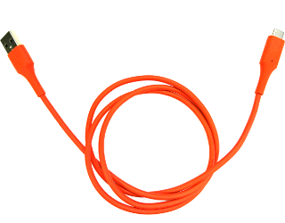

# Closed Case Debug (CCD)

[TOC]

## Introduction

In order to get access to the AP and EC consoles or reprogram a Chrome OS
device's firmware or BIOS without using the AP, older Chrome OS devices required
opening the device to get access to a debug header used by [Servo]. These servo
headers are frequently unpopulated on production units.

Newer Chrome OS devices have a secure microcontroller(Google Security Chip or
GSC) in them which runs an embedded OS called Cr50 or Ti50. Among other
capabilities, this chip allows developers to securely debug the device without
physically opening it.

Current GSC capabilities allow read/write access to a UART on the AP and a UART
on the EC, as well as a SPI interface (normally used to access the flash chips)
and an I2C interface (normally used to access INAs, but may be used to flash the
EC). Closed Case Debug replaces the capabilities that previously relied on the
servo header. Outside of ccd, the servo USB connection also provides:

*   power supply
*   a network interface
*   the ability to mux a USB device between the DUT and the servo host
*   keyboard emulation

This document describes basic "Closed Case Debug" (CCD) and debug cable (SuzyQ)
information. For more in depth instructions on using CCD see the following:

*   [General CCD information and background][CCD]
*   [Guide to setting up GSC CCD][GSC CCD]: GSC restricts most CCD features.
    You need to "open" GSC CCD and enable access to most GSC CCD capabilities.

## Communicating with Google Security Chip(GSC)

The GSC code uses the microcontroller’s USB interface to expose its debugging
functionality. This interface can be reached via a special USB Type-C cable
called "SuzyQ" on one of the system’s ports.

To put GSC into debug mode, the SuzyQ cable has to present itself as a Debug
Accessory (see Chapter B of the USB Type-C Specification). When this cable is
detected the system will connect the GSC full-speed USB2.0 interface to the SBU
pins of the Type-C connector. Note that this prevents use of the DisplayPort
alternate-mode (which also uses the SBU pins) but preserves regular USB
operation on the port.

Once the SuzyQ cable is connected, GSC makes several USB endpoints available to
the host to communicate with the consoles, to program firmware, etc. More
details about [setting up GSC][GSC CCD] and these [CCD software interfaces can
be found in the documentation section of the EC codebase][servo_micro ccd].

### SuzyQ / SuzyQable

SuzyQ is a cable that tells the GSC to go into debug mode. SuzyQ includes a USB
hub in the cable, which allows the host computer to access both the debug
interface (on the SBU pins) and any gadget-mode interfaces exposed by the
device-under-test (for example an ADB interface for debugging Android
applications). [Reference schematics][SuzyQ Schematics] are available for the
SuzyQ. To run Tauto or TAST tests, you will generally need to attach a
USB-to-ethernet adapter as well. While you could try to use wifi,
any test that switches boot modes (i.e. normal -> dev) will erase the
wifi settings and fail.

Historically, this cable used to be available for [purchase from
Sparkfun][SparkFun SuzyQable], but as of late 2021, this product will
likely be unavailable for the foreseeable future due to a supply chain
shortage.  See the instructions below for [making your
own](#making-your-own-suzyq).



<!-- mdformat off(b/139308852) -->
*** note
NOTE: The cable will generally only work in one port and one orientation. If it
doesn't work try the other port, or flip the connector. Check the
[Chrome OS device list] for more details about the specific device you are
using.

To see if it worked you can check the presence of `/dev/ttyUSB*` devices, or
monitor `lsusb` for GSC device enumeration:

```bash
# H1/Cr50
(HOST) $ watch -n 1 "lsusb | grep 18d1:5014"
# D2/Ti50
(HOST) $ watch -n 1 "lsusb | grep 18d1:504a"
```
***
<!-- mdformat on -->

#### Making your own SuzyQ

One needs a [USB Type-C Male breakout board] and some way of connecting the
other end to a computer’s USB port (like a Type A Male port).

Type C Male            | Other host (Type A Male)
---------------------- | ------------------------
A8 (SBU 1)             | D+
B8 (SBU 2)             | D-
A4, A9, B4, B9 (VBUS)  | VBUS, 5V
A5 (CC1)               | 22 kΩ 1%  resistor to VBUS
B5 (CC2)               | 45.3 kΩ 1% resistor to VBUS *
A1, A12, B1, B12 (GND) | GND

\* In a pinch, a lower tolerance resistor like 5% and 56 kΩ instead of
45.3 kΩ might work, but the higher accuracy resistor is recommended
especially on devices using the new D2/Ti50 GSC.

Note that unlike the [Sparkfun SuzyQable], this cable does not include
an internal USB hub, so you won't be able to use the same cable for
ADB and CCD at the same time, but this is a rare requirement.

There is a [video tutorial on making your own SuzyQable] available for
those interested.

### Servo v4

[Servo v4] also has CCD capabilities (routing SBU lines to the USB host,
signaling on the CC lines debug accessory mode), so it can be used as an
alternative to the SuzyQ cable. During debugging, Servo v4 will normally allow
the device-under-test to act as a USB host, providing it with an Ethernet
interface and USB flash device that may be used for a recovery image. Servo v4
allows USB Type-C connection automation (both data and charging). Servo v4 also
has a keyboard emulator.

## Using CCD

To use most of the features of CCD, on your Linux workstation you need to
configure [Servod outside Chroot](./servod_outside_chroot.md).

The [hdctools] \(Chrome OS Hardware Debug & Control Tools) package contains
several tools needed to work with `servod`. Chroot and Docker both will
automatically check for updates periodically but you can force an update:

```bash
(HOST) $ start-servod --force_update
```

On your workstation, `servod` must also be running to communicate with GSC:

```bash
(HOST) $ start-servod -b "$BOARD"
```

CPU/AP UART can be accessed by running:

```bash
(HOST) $ minicom -D "$(dut-control -- -o cpu_uart_pty)"
```

Note that on a normal install of Chrome OS the UART is not normally used. The
device must be in [Developer Mode] or using a custom OS.

On most x86 production images the UART drivers are also disabled for performance
reasons, but they can be added back in with a custom AP firmware.

EC UART:

```bash
(HOST) minicom -D "$(dut-control -- -o ec_uart_pty)"
```

The console is read only, unless you have [opened CCD][GSC CCD]. The console
will show various debug mesages from charging, keyboard scanning, power state.

GSC itself has a console available, but most commands are locked by default for
security:

```bash
(HOST) minicom -D "$(dut-control -- -o gsc_uart_pty)"
```

#### Features

Most CCD features are locked down by default on GSC. You need to enable them
before you can use them. For information on setting up GSC CCD see the
[GSC CCD setup doc][GSC CCD].

*   Control of firmware write protect.
*   Flashing of the AP and EC firmware.
*   EC RW console access.
*   Read I2C INA219 current sensors (though most production boards do not have
    them populated).

### Raw Access {#raw-access}

A subset of these features (e.g., UART lines) can be accessed with consoles
like minicom without servod running.

Once the SuzyQ is plugged in, three `/dev/ttyUSB` devices will enumerate:

1.  GSC console
1.  CPU/AP console (RW)
1.  EC console (RW)

## Device Support

The "Closed Case Debugging" column in the [Chrome OS device list] indicates
whether CCD is supported.

If the device is ARM, the CPU/AP UART works by default in dev mode (you should
see a login prompt). x86 devices disable it for performance / power reasons, but
[UART can be re-enabled with a custom firmware](https://docs.google.com/presentation/d/1eGPMu03vCxIO0a3oNX8Hmij_Qwwz6R6ViFC_1HlHOYQ/edit#slide=id.gf3c00a91_0218).

[Servo]: ./servo.md
[Servo v4]: ./servo_v4.md
[hdctools]: https://chromium.googlesource.com/chromiumos/third_party/hdctools
[CCD]: https://chromium.googlesource.com/chromiumos/platform/ec/+/HEAD/board/servo_micro/ccd.md
[Cr50 CCD]: https://chromium.googlesource.com/chromiumos/platform/ec/+/cr50_stab/docs/case_closed_debugging_cr50.md
[servo_micro ccd]: https://chromium.googlesource.com/chromiumos/platform/ec/+/HEAD/board/servo_micro/ccd.md
[Sparkfun SuzyQable]: https://www.sparkfun.com/products/14746
[USB Type-C Male breakout board]: https://www.google.com/search?q=USB+Type-C+Breakout+Board+Male
[video tutorial on making your own SuzyQable]: https://youtu.be/WGsyXlgSxFk
[SuzyQ Schematics]: https://www.chromium.org/chromium-os/ccd/951-00273-01_20180607_suzyqable_SCH_1.pdf
[Developer Guide]: https://chromium.googlesource.com/chromiumos/docs/+/HEAD/developer_guide.md
[Developer Mode]: https://chromium.googlesource.com/chromiumos/docs/+/HEAD/developer_mode.md
[Chrome OS device list]: https://www.chromium.org/chromium-os/developer-information-for-chrome-os-devices
