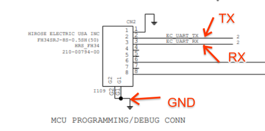

# Servo

Servo Micro (aka "uServo") is a self contained replacement for Yoshi Servo Flex.
It is meant to be compatible with Servo v2 via [`servod`]. The design uses
[Case Closed Debug][CCD] software on an STM32 microcontroller to provide a [CCD]
interface into systems with a Yoshi debug port.

[TOC]

## Overview

Servo Micro is usually paired with a [Servo v4 Type-A], which provides ethernet,
dut hub, and muxed usb storage.

*   [Servo Micro Schematics]
*   [Case Closed Debug with Servo Micro][Servo Micro CCD]

![Servo Micro]

## Use

Like other Servo boards, the Servo Micro requires [`servod`] to be running:

```bash
(HOST) $ start-servod -b [board]
```

The Servo Micro connects to the servo header of the DUT in the orientation where
'dot' indications from the Servo Micro and the servo header align:

![Servo Micro and Header Dot Close-up]

Most Servo header functionality should be available, used in the same way as any
other servo. Here you can see the Servo v4 and Servo Micro plugged into a
system.

![Servo Micro and Servo v4]

### Flashing the BIOS or EC with Servo Micro

Reading or flashing AP firmware (BIOS) or EC firmware with Servo Micro is done
with the same commands as any servo type.  Under the hood the implementation
for each servo type can vary, but that is abstracted away from you as a user.

For example, to read and flash AP firmware (BIOS):

```bash
(chroot) $ sudo futility read --servo -v "$OUTFILE"
(chroot) $ sudo futility update --servo -v -i "$INFILE"
```

## Servo Micro Header Pins

The names of the pins loosely correspond to the name of the controls used by
[`servod`]. For example, `DUT_LID_OPEN` corresponds to [`lid_open`]. See the
[Servo Micro Schematics] for complete details of how the header is connected to
the Servo Micro internals.

![Servo Micro Header Pins]

### Power Sourcing

Servo Micro is designed to supply power to power-monitoring ICs, independent
from the DUT's power supply. This allows more accurate measurements of total
system power when the DUT is in a low-power state. We expect less than 50mW
of power if the maximum number of power-monitoring IC is in use drawing
from the PP3300 pin.

The PP3300 and VREF pins on the connector can provide a maximum total of 100mA
of current before exceeding limits and damaging the regulators. Future designs
may reduce the limit and use resettable fuses to reduce the risk of damaging
components. Designs should target a limit under 50mA.

## Known Issues

*   JTAG - Servo Micro does not support JTAG.
*   Servo Micro doesn't support `jtag_vref`, or any `_buf_on_flex` controls.
*   If a Servo Micro is plugged into a DUT without being plugged into a host
    machine, it can cause undefined behavior on the DUT.

### Uart Failures

See https://crbug.com/936182.

On Servo micro (and perhaps other STM based Servos (v4)) the UART can become
inoperable and require the USB port to be reset to recover.

This will manifest itself as failures like:

```
Servod - ERROR - Problem initializing SERVO_JTAG_TDI -> off
```

or

```
Problem with ['servo_v4_version'] :: Timeout waiting for response
```

### Overcurrent and Brownouts

See https://crbug.com/1016051.

Some device configurations (verified on cyan boards) are able to draw excessive
current from the Servo Micro, putting the hardware in a non-responsive state.
Brownout detection has been enabled to escape this condition by rebooting the
servos impacted. Impacted DUTs may require deployment using [Servo v2].

## Updating Firmware {#updating-firmware}

The latest firmware is available via the servod docker image. You need to have go/servod
configured. That would also add servo_updater CLI to your host shell.

<!-- mdformat off(b/139308852) -->
*** note
**NOTE**: [`servod`] must not be running. You should have recent versions of
start-servod and servo_updater scripts that are in hdctools repo (repo sync)

***
<!-- mdformat on -->

**Update to latest stable firmware:**

```bash
(HOST) $ servo_updater -- -b servo_micro
```

**Rollback to previous stable version if needed:**
```bash
(HOST) $ servo_updater -- -b servo_micro -c prev --allow-rollback
```
---
Advanced usage below:

- Update to specific binary file

```bash
(HOST) $ servo_updater -f <file_path> -- -b servo_micro
```

- Update to specific FW channel

```bash
(HOST) $ servo_updater -- -b servo_micro -c [alpha|dev|prev|stable]
```

- If you need to update FW, before it reaches monthly released servod image specify
channel for servod docker distribution ("release" is default)

```bash
(HOST) $ servo_updater --updater_channel [local|latest|beta|release] -- -c [alpha|dev|prev|stable] -b servo_micro [...]
```


## Developing Servo Micro Firmware

### Compiling

servo micro code lives in the ec codebase. It can be built as follows:

```bash
(chroot) $ cd ~/chromiumos/src/platform/ec
(chroot) $ make BOARD=servo_micro -j8
```

### Flashing

To flash a working Servo Micro:

```bash
(HOST) $ servo_updater -f build/servo_micro/ec.bin -- -b servo_micro
```

If the flash is empty or the image is broken, you can flash the Servo Micro
using the `BOOT0` select pin, which is held by USB OTG's ID pin. The easiest way
to do this is to plug a USB OTG adapter into Servo Micro, then plug an A-A cable
into your desktop and Servo Micro.

```bash
(chroot) $ ./util/flash_ec --board=servo_micro
```

![Servo Micro USB OTG]

## Servo Micro UART

Servo Micro exports a console UART over the small header next to the USM-micro
port. There is a rare cable for this header, but it's easier to just rework UART
wires on and use a standard FTDI pin header 3.3V cable.



## Servo Micro As GSC Console

Sometimes it is necessary to debug GSC interactions with the DUT, especially
during early hardware bringup when GSC is still not communicating reliably
over USB.

This is when the direct access to the GSC console is needed. In this situation
GSC console could be accessed over a dedicated device created by `servod`.

But having to run `servod` (and create the Chrome OS chroot for that) is a
pretty high barrier for many users. Luckily Servo Micro provides all necessary
features directly, no need to create chroot and run servod to access them.

To use Servo Micro as the GSC console, attach Servo Micro to the servo header
on the DUT and connect it to the workstation as described above.

The following command allows you to find tty USB devices created to access
various consoles available through Servo Micro:

```
$ find /dev -type l -name '*Servo_Micro*' -exec readlink -f "{}" +
/dev/ttyUSB2
/dev/ttyUSB3
/dev/ttyUSB0
/dev/ttyUSB1
```

If you don't see the four devices unplug and re-plug the USB cable connecting
to Servo Micro.

Of the four `/dev/ttyUSBx` devices, the lowest index device is the GSC
console, and the second lowest index is the Servo Micro console.

To get access to GSC console, first connect to the Servo Micro console and
send it commands to completely disengage Servo Micro from the DUT, leaving
only GSC console connected:

```
$  minicom -D /dev/ttyUSB<second lowest>
...
> gpioset UART2_EN_L 1         # Disconnect the EC UART
> gpioset UART1_EN_L 1         # Disconnect the AP UART
> i2cxfer w 0 0x20 6 0xff      # Set all extended GPIOs as inputs
> i2cxfer w 0 0x20 7 0xff
> i2cxfer w 0 0x20 3 0         # Prepare GSC reset output level
```

To connect to the GSC console run ` minicom -D /dev/ttyUSB<lowest>`.

To reset the GSC, issue the following two commands on the Servo Micro console

```
> i2cxfer w 0 0x20 7 0xbf     # Assert reset
> i2cxfer w 0 0x20 7 0xff     # Deassert reset
```


<!-- Links -->

[Servo Micro Schematics]: https://docs.google.com/viewer?a=v&pid=sites&srcid=Y2hyb21pdW0ub3JnfGRldnxneDo2Njk1MGFiOTRkY2E5MGM5
[CCD]: https://chromium.googlesource.com/chromiumos/platform/ec/+/cr50_stab/docs/case_closed_debugging.md
[Servo v4 Type-A]: ./servo_v4.md
[Servo Micro CCD]: https://chromium.googlesource.com/chromiumos/platform/ec/+/HEAD/board/servo_micro/ccd.md
[`servod`]: ./servod.md
[Servo v2]: ./servo_v2.md
[`lid_open`]: https://chromium.googlesource.com/chromiumos/third_party/hdctools/+/0c4e47b14d669deece85ad883069feaef9230899/servo/data/servo.xml#178

<!-- Images -->

[Servo Micro]: ./images/servo_micro.jpg
[Servo Micro and Header Dot Close-up]: ./images/servo_micro_and_header_dot.jpg
[Servo Micro and Servo v4]: ./images/servo_micro_servo_v4_dut.jpg
[Servo Micro USB OTG]: ./images/servo_micro_usb_otg.jpg
[Servo Micro UART]: ./images/servo_micro_uart.png
[Servo Micro Header Pins]: ./images/servo_micro_header_v2.png
