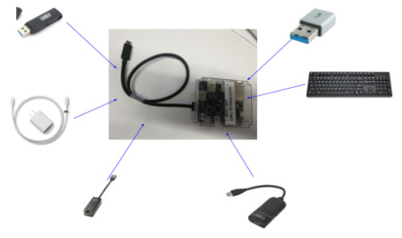
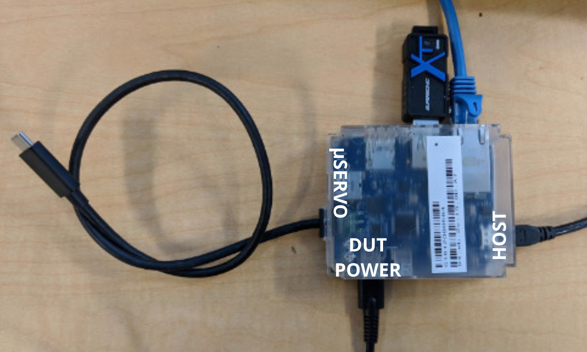
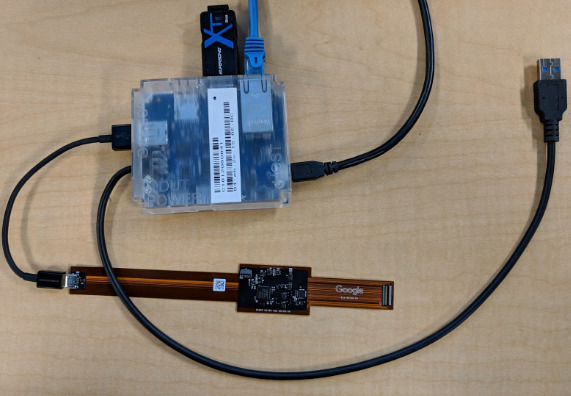

# Servo v4

Servo v4 is a debug device in the Servo family.

Servo v4 functions as a configurable USB hub to support developer and lab
recovery features. However, it doesn't have any hardware debug features on its
own. It must be paired with CCD (GSC's on-board servo implementation) or
[Servo Micro].

[TOC]

## What is Servo v4?

Servo v4 combines the functionality of the following devices into one:

*   Ethernet-USB dongle
*   Muxable USB port
*   microSD to USB3.0 dongle
*   Keyboard emulator
*   Pass through charger
*   [Case-Closed Debug (CCD)][CCD] interface ([SuzyQ] debug cable)

Details:

*   [Servo v4 Block Diagram]
*   [Servo v4 Schematic]



## Getting Servo v4

<!-- mdformat off(b/139308852) -->
*** promo
Sorry, Servo v4 is not publicly available for purchase.
***
<!-- mdformat on -->

<!-- mdformat off(b/139308852) -->
*** note
**IMPORTANT**: You will need to [update the firmware](#updating-firmware)
before using, as the factory firmware is quite old.
***
<!-- mdformat on -->

### Partners

Your contact at Google should be able to provide you with Servo v4.

### Googlers

Stop by your local Chromestop, or use http://go/hwrequest and enter `Servo V4`
for the `Google Code Name`.

## How to Use Servo v4

The plastic case has labels `HOST`, `DUT POWER`, and `uSERVO`.

*   `HOST`: Servo v4 can be plugged into a host machine using a micro-B USB
    cable via the micro-B USB port marked `HOST`. This will power Servo v4 while
    allowing the user to control Servo v4 using [`servod`].

*   `DUT POWER`: USB-C port labeled `DUT POWER` is for powering the DUT through
    the Servo. Servo v4 can be used to power the DUT which becomes useful for
    devices that use USB-C as their only charge port (tablets, phones etc.). The
    Type-C port can be used to plug in any Type-C charger to provide full
    charging capabilities as a charge through hub. If no charger is plugged,
    Servo v4 will act as a passive hub.

*   `uSERVO`: On the side labeled `uSERVO` there are two connectors.

    *   The DUT connector (which is a captive cable: servo side is permanently
        connected) can be plugged into a DUT, providing the DUT access to the
        ethernet and blue USB port. The Type-C captive cable enables debugging
        of devices that have a GSC (recent Chromebooks) through [CCD].

    *   The "uServo" USB port can be used to plug a servo micro to debug DUT
        over the Yoshi debug header.

*   The following ports on the unlabeled side can be used to download data to a
    device:

    *   Ethernet
    *   microSD card
    *   USB stick

Servo v4 has an embedded keyboard so keystrokes can be emulated on the DUT.

The [`servod`] server must be running for Servo v4 to work. Details can be found
on the [Servo] page.

## Type-A vs Type-C Variants

There are two variants of Servo V4: Type-A and Type-C.

Both versions use the same board and case, but have a different captive cable
stuffed.

### Type-C Version

The Type-C version acts as both a USB hub and PD charger. Servo v4 can also
control both CC terminations which allows it to act as a debug accessory. It
should be used on systems with [CCD]. In other words if you need the GSC
console, you need this version.

<!-- mdformat off(b/139308852) -->
*** note
NOTE: Type-C Servo v4 is a charge-through hub and is NOT functionally equivalent
to a Type-A servo with an A-to-C adapter. DO NOT use a Type-C Servo v4 just
because you want to plug into a Type-C port. Older Chromebooks (Eve, Samus,
etc.) have [EC] bugs that prevent charge through hubs from working correctly.
***
<!-- mdformat on -->



### Type-A Version

The Type-A version is used with a uServo and serves as the DUT USB hub, with the
uServo providing SPI and UART support.



## Servo v4 Revisions

Servo v4 had several revisions, indicated by board color. The mass production
(MP) version is available from Chromestop.

### Green (MP)

Final version, has full functionality.

### Blue (DVT)

The DVT version is completely functional except for the one bug affecting only
Type-C variant. There are about one thousand of these, so you may encounter
them.

*   PD Charge-through only works on chargers up to 10V.
*   Firmware identifies this by board revision and will not negotiate any
    voltages above 10V.

### Red (EVT)

The EVT version is a mostly functioning version with a few bugs. There are
around three hundred of these total.

*   The ethernet IC has a bug in it that makes the device fall out of
    GigE/USB3.0 speeds under certain circumstances and it falls down to USB1.1 /
    2 speeds and never properly recovers until reset.
*   Type-C variant doesn't function, Type-A works OK.

## Software

Servo v4 runs more or less equivalently to Servo v2, through [`servod`].
It's intended to be mostly transparent, but there are some differences.

Most functionality is exported through `dut-control`.

```bash
(HOST) $ start-servod -b <board> -s <serial>
```

To use with a specific board, you can connect a servo_micro to the "uServo"
labeled port (or use the Type-C cable to connect to [CCD]) and run [`servod`],
which will load the board config and control both Servo v4 and Servo Micro (or
GSC).

```bash
(HOST) $ start-servod -b [board] -s [serialno printed on servo v4 sticker]
```

### Recipes

#### Connect to Servo_v4 console with Servod

```bash
(HOST) $ minicom -D "$(dut-control -- -o servo_v4_uart_pty)"
```

#### Connect to Servo consoles without servod

When Servos are plugged in, it creates several console endpoints starting at
`/dev/ttyUSB0` and incrementing based on the hardware present. If you connect
to these you can directly interact with the Servo firmware STM32 or DUT shells.
Not all shells will be active depending on device setup.

```bash
(HOST) $ minicom -D /dev/ttyUSB0
> version
Chip:   stm stm32f07x
Board:  3
RO:     servo_v4p1_v2.0.24151-03b2123fb
```

#### Switch SD to Host

```bash
(HOST) $ dut-control -- sd_en:on sd_pwr_en:on sd_mux_sel:servo_sees_usbkey host_sd_usb_mux_en:on host_sd_usb_mux_sel:sd
```

#### Switch SD to DUT

```bash
(HOST) $ dut-control -- sd_en:on sd_pwr_en:on sd_mux_sel:dut_sees_usbkey
```

#### Disable SD

```bash
(HOST) $ dut-control -- sd_en:off sd_pwr_en:off
```

#### Switch USB3 to Host

```bash
(HOST) $ dut-control -- usb3_mux_en:on usb3_mux_sel:servo_sees_usbkey usb3_pwr_en:on host_sd_usb_mux_en:on host_sd_usb_mux_sel:usb
```

#### Switch USB3 to DUT

```bash
(HOST) $ dut-control -- usb3_mux_en:on usb3_mux_sel:dut_sees_usbkey usb3_pwr_en:on
```

### Disable/Enable [SuzyQ] wiring (debug accessory mode)

<!-- mdformat off(b/139308852) -->
*** note
Type-C Servo v4 only
***
<!-- mdformat on -->

```bash
(HOST) $ dut-control -- servo_v4_dts_mode:off [on]
```

#### Connect remotely

```bash
(HOST) $ dut-control -- --host XXX --port YYY
```

### Disable/Enable Chargethrough

<!-- mdformat off(b/139308852) -->
*** note
Type-C Servo v4 only
***
<!-- mdformat on -->

```bash
(HOST) $ dut-control -- servo_v4_role:snk [src]
```

## Firmware flashing and reading

<!-- mdformat off(b/139308852) -->
*** note
When flashing the BIOS or EC with [CCD], you need to make sure the [`FlashAP`]
capability is enabled in GSC.
***
<!-- mdformat on -->

Read and flash AP firmware (BIOS) with CCD or any other servo debug connection:

```bash
(chroot) $ sudo futility read --servo -v "$OUTFILE"
(chroot) $ sudo futility update --servo -v -i "$INFILE"
```

## Updating Firmware {#updating-firmware}

The latest firmware is available via the servod docker image. You need to have go/servod
configured. That would also add servo_updater CLI to your host shell.

<!-- mdformat off(b/139308852) -->
*** note
**NOTE**: [`servod`] must not be running. You should have recent versions of
start-servod and servo_updater scripts that are in hdctools repo (repo sync)

***
<!-- mdformat on -->

**Update to latest stable firmware:**

```bash
(HOST) $ servo_updater -- -b servo_v4
```

**Rollback to previous stable version if needed:**
```bash
(HOST) $ servo_updater -- -b servo_v4 -c prev --allow-rollback
```
---
Advanced usage below:

- Update to specific binary file

```bash
(HOST) $ servo_updater -f <file_path> -- -b servo_v4
```

- Update to specific FW channel

```bash
(HOST) $ servo_updater -- -b servo_v4 -c [alpha|dev|prev|stable]
```

- If you need to update FW, before it reaches monthly released servod image specify
channel for servod docker distribution ("release" is default)

```bash
(HOST) $ servo_updater --updater_channel [local|latest|beta|release] -- -c [alpha|dev|prev|stable] -b servo_v4 [...]
```

## Enabling Case Closed Debug (CCD)

See [CCD] for complete details.

<!-- mdformat off(b/139308852) -->
*** note
If using a Type-C Servo v4, these commands will only work if the USB-C cable is
plugged into the correct USB port. Generally, this is the USB port on the left
side of the device. If the command doesn't work, try the other ports.
***
<!-- mdformat on -->

Connect to GSC console:

```bash
(HOST) $ minicom -D "$(dut-control -- -o gsc_uart_pty)"
```

Check the GSC FW version in the GSC console:

```
> version
Build:   0.4.10/cr50_v1.9308_B.269-754117a
```

<!-- mdformat off(b/139308852) -->
***note
CCD requires Cr50 version 0.3.9+ / 0.4.9+
*   0.4.x is the "pre-pvt" version, for pre-production devices.
*   0.3.x is the "mp" version, for production devices. This requires the device
    to be in developer mode before "ccd open".
*   0.0.22 is the factory preflash from GUC. It needs an update.
***
<!-- mdformat on -->

Open CCD in the GSC console:

```
> ccd open
```

Press power button when prompted. It should take around 5 minutes.

<!-- mdformat off(b/139308852) -->
*** note
If you get an access denied error when attempting `ccd open`, you likely do
not have developer mode enabled.
***
<!-- mdformat on -->

<!-- mdformat off(b/139308852) -->
*** note
GSC loses the developer mode state after "opening CCD". If your device boots
into recovery mode, try re-entering developer  mode.
***
<!-- mdformat on -->

Enable testlab mode in the GSC console:

```
> ccd testlab enable
```

Press power button some more. CTRL+C to exit.

Run [`servod`] as normal, [CCD] should be enabled now.

## Known issues

*   Displayport - not supported
*   Type-A/Type-C: Servo V4 comes in two variants on the captive cable, both can
    be obtained from Chromestop.
*   Type-C Servo is not interchangeable with Type-A. Type-C must be paired with
    CCD, Type-A must be paired with Servo Micro.
*   DFU: To use util/flash_ec you must enable DFU by connecting servo with an
    A-A cable plugged into an OTG cable. USB ID is tied to BOOT0 indicator on
    the STM32 part.

### Interop Problems with Some Switches

See http://b/112187276.

Your network switch port will get hosed (some TX buffer fills up and starts
dropping things) if you have Servo v4 connected to most switches and unplug the
servo's USB connection, or power off the DUT fully, after the servo's NIC has an
IP. This behavior is not reproducible with a [GS108Tv2], so the workaround is to
use a [GS108Tv2].

[GS108Tv2]: https://www.amazon.com/NETGEAR-Ethernet-Unmanaged-Lifetime-Protection/dp/B003KP8VSK/

## Bugs

File bug or feature requests [here][Bug].

## Programming

<!-- mdformat off(b/139308852) -->
*** note
You don't need to do this unless you're developing Servo v4 firmware.
***
<!-- mdformat on -->

Servo v4 code lives in the [EC] and [`hdctools`] codebase. It can be built as
follows:

```bash
(chroot) $ cd ~/chromiumos/src/platform/ec
(chroot) $ make BOARD=servo_v4 -j8
```

To raw flash a Servo v4, `BOOT0` select pin is indicated by the OTG cable:

```bash
(chroot) $ ./util/flash_ec --board=servo_v4
```

To set the Servo v4 serial number on the Servo console:

```
> serialno set 012345
```

[Servo]: ./servo.md
[Servo v4 Block Diagram]: https://docs.google.com/drawings/d/1Ba0ut5-MeAOKpLQZ7nFbEaxFD_kFMGIIQmF6SxBUjc4/edit
[Servo v4 Schematic]: https://docs.google.com/a/chromium.org/viewer?a=v&pid=sites&srcid=Y2hyb21pdW0ub3JnfGRldnxneDo1ZmQ5NjFmMGZlZjFiYjk5
[Servo Micro]: ./servo.md
[EC]: https://chromium.googlesource.com/chromiumos/platform/ec
[`servod`]: ./servod.md
[SuzyQ]: ./ccd.md#suzyq-suzyqable
[CCD]: ./ccd.md
[`FlashAP`]: https://chromium.googlesource.com/chromiumos/platform/ec/+/cr50_stab/docs/case_closed_debugging_cr50.md#flashap
[Bug]: https://issuetracker.google.com/issues/new?component=983411&template=1678684
[`hdctools`]: https://chromium.googlesource.com/chromiumos/third_party/hdctools
