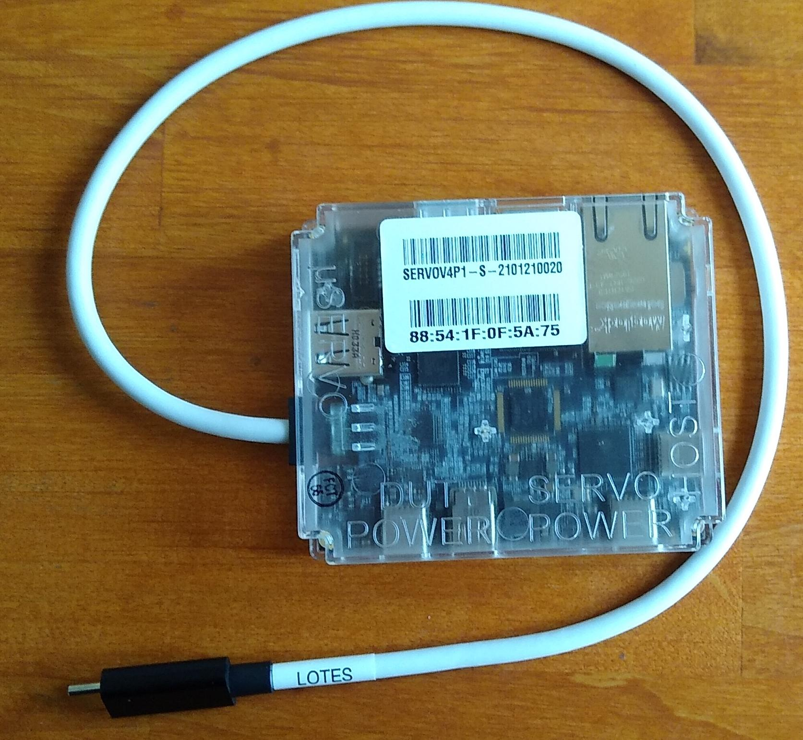

# Servo v4.1

Servo v4.1 is a debug device in the Servo family and is a superset of the v4 device.

Servo v4.1 functions as a configurable USB hub to support developer and lab
recovery features. However, it doesn't have any hardware debug features on its
own. It must be paired with CCD (GSC's on-board Servo implementation) or
[Servo Micro].  The Servo is controlled by a host and the Servo attaches to a
chromebook DUT.


[TOC]

## How do the Servo v4.1 and v4 compare?


Feature                              | v4.1            | v4
------------------------------------ | --------------- | ---------------------
Host USB connector type              | C               | Micro
Host max speed to switched USB ports | USB2 480 Mbps default, USB3 5 Gbps [when enabled](#enabling-host-USB3) | USB2 480 Mbps
Servo Power Options                  | Host BC1.2,     | Host only
''                                   | Host USBC @ 5V, |
''                                   | Alternate Power Port @ 5V |
Switchable USB ports                 | 2x USB3.0       | 1x USB3.0, SD Reader
CC DACs on DUT                       | Yes             | No
DisplayPort                          | 4 lanes HBR2    | No
DisplayPort power for dongles        | 3.3V @ 500mA    | No
EC SWD debug port                    | Yes             | No
EC DFU recovery mechanical switch    | Yes             | No
DUT Vbus auto discharge option       | Yes             | No
DUT max Vbus current                 | 3A+             | 3A
Alternate UART to RJ11               | Yes             | No
Ethernet power on/off                | Yes             | No


Servo v4.1 has a number of minor bug fixes to v4 and BOM replacement for EOL parts.

For most users, replace the host cable from USB micro to USB C type and then update the servod software by the normal methods, and the Servo v4.1 will drop in to the old solution.


## What is Servo v4.1?

Servo v4.1 combines the functionality of the following devices into one:

*   Ethernet-USB dongle
*   2x muxable USB3 ports
*   Keyboard emulator
*   Pass through charger
*   [Case-Closed Debug (CCD)][CCD] interface ([SuzyQ] debug cable)

## Where are the schematics?

For schematics and other hardware design collateral, visit the Chrome OS Partner Site.

Look under the 'Released Reference Designs' on the left window pane.



## Getting Servo v4.1

<!-- mdformat off(b/139308852) -->
*** promo
Sorry, Servo v4.1 is not publicly available for purchase.
***
<!-- mdformat on -->

<!-- mdformat off(b/139308852) -->
*** note
**IMPORTANT**: You should [update the firmware](#updating-firmware)
before using, as the factory firmware may be out of date.
***
<!-- mdformat on -->

### Partners

Your contact at Google should be able to provide you with Servo v4.1.

### Googlers

Stop by your local Chromestop, or use http://go/hwrequest and enter `Servo V4.1`
for the `Google Code Name`.

## How to Use Servo v4.1

Servo v4.1 must be plugged into a host machine using a USBC cable. This will
power the Servo while allowing the user to control the Servo using [`servod`].

The Servo can be powered by the host cable (with BC1.2 and up to 5V @ 3A from a USBC cable) or from the Servo Alternate Power port. If the Servo power needs exceed the host port capability, the Servo Alternate Power Port may be used instead.  Presently the EC code is RAM limited, so the full input range of the Servo Alternate Power port (5V-15V @3A) is reduced to 5V only, with PD unsupported.   When the Alternate power port is present, the Servo will automatically switch to the Alternate port to power the Servo.  When the Alternate power port is used, the Servo has the ability (through software control) to remain powered when the host computer/hub has its own power removed.

The DUT cable (which is a captive) can be plugged into a Chromebook (Device under Test), providing the
DUT access to the ethernet and stacked USB ports inside the Servo.  This port can support other USB devices as well.

The Type-C captive cable enables debugging of devices that have a GSC (recent
Chromebooks) through [CCD].

The "uServo" USB port can be used to plug a Servo micro to debug devices over
the Yoshi debug header.

From here other functionality is available. The following devices can be used to
download data to the DUT:

*   Ethernet (only available to DUT)
*   USB flash drives (dynamically configurable, can attach to host or DUT)

Additionally Servo v4.1 can be used to power the DUT which becomes useful for
devices that use USB as their only charge port (tablets, phones etc.). The
Type-C port can be used to plug in any Type-C charger to provide full charging
capabilities as a charge through hub. If no charger is attached, Servo v4.1 will
act as a passive hub.

Servo v4.1 has an embedded keyboard so keystrokes can be emulated on the DUT.

The [`servod`] server must be running for Servo v4.1 to work. Details can be found
on the [Servo] page.

The Type-C Servo version acts as both a USB hub and PD charger. Servo v4.1 can also
control both CC terminations which allows it to act as a debug accessory. It
should be used on systems with [CCD].

### Recommended setup

It is recommended to attach the Servo to the Host through a powered USB hub
capable of at least 1.5A per port.  Depending what you connect to the Servo,
you may need greater power, up the 3A maximum supported by USB-C without PD.
(Servo v4.1 does not support USB PD for its own power, it can only use 5V at
up to 3A.)

Besides that, experience has shown that connecting the servo in the
following order is the most reliable:

1. Host cable
2. Servo Power supply (optional)
3. DUT Power supply (if used)
4. DUT cable
5. DisplayPort

The other peripherals (USBA ports, RJ22, RJ45) can be attached at any time
because they won't affect operation positively or negatively.

## Servo v4.1 LEDs

* Red power:  Lit when unit is powered.  Located near host USBC connector.

* Red s/w configured: Lit per EC code.  Located near uServo USBA connector.

* Blue DFM:  Lit when EC boots in DFM mode, based upon slider switch.  This LED should be off for standard operation.

* Green DUT Power:  Lit after PD contract with DUT has completed, to indicate DUT Power port is providing power to DUT
* Orange DUT Power:  Lit after PD contract with DUT has completed, to indicate Servo is providing internally generated 5V to DUT

These DUT Power LEDs are near the center of the Servo.

* Green Hub Port:  Host hub controlled; lit when the A0 (top) USB stacked port is present and attached to the host.  LED is near RJ45 on the PCB.

RJ45 LEDs, viewed from the front of RJ45 connector
* Left- Activity / Link
* Right- Speed:   Green = 1000M, Yellow = 100M, off = 10M


## Servo v4.1 Revisions

Servo v4.1 had several revisions, indicated by board color. The mass production
(MP) version is available from Chromestop.

### Blue or Black Soldermask (DVT/MP)


### Green Soldermask (EVT)

The EVT version is a mostly functioning version with a few bugs. There are
around sixty of these EVT units total.

*   The host port BC1.2 detection sometimes malfunctions and won't permit the EC
    to be detected by the host.


## Software

Servo v4.1 runs more or less equivalently to Servo v2, through [`servod`].
It's intended to be mostly transparent, but there are some differences.

Most functionality is exported through `dut-control`.

```bash
$  start-servod -b <board> -s <serial>
```

To use with a specific board, you can connect a servo_micro to the "uServo"
labeled port (or use the Type-C cable to connect to [CCD]) and run [`servod`],
which will load the board config and control both Servo v4.1 and Servo Micro (or
GSC).

```bash
$ start-servod -b [board] -s [serialno printed on Servo sticker]
```

### Recipes


#### Connect to Servo_v4p1 console with Servod

```bash
(HOST) $ minicom -D "$(dut-control -- -o servo_v4p1_uart_pty)"
```

#### Connect to Servo consoles without servod

When Servos are plugged in, it creates several console endpoints starting at
`/dev/ttyUSB0` and incrementing based on the hardware present. If you connect
to these you can directly interact with the Servo firmware STM32 or DUT shells.
Not all shells will be active depending on device setup.

```bash
(HOST) $ minicom -D /dev/ttyUSB0
> version
Chip:   stm stm32f07x
Board:  3
RO:     servo_v4p1_v2.0.24151-03b2123fb
```

#### Switch USB3 to Host or DUT

Both USB3 type A ports can be individually powered or routed to either host or DUT.

To enable the mux:

```bash
(HOST) $ dut-control -- usb3_mux_en:on
```

To toggle the top and bottom ports:

```bash
(HOST) $ dut-control -- top_usbkey_pwr:on # top port -> on
(HOST) $ dut-control -- bottom_usbkey_pwr:off # bottom port -> off
```

To route them to host or DUT:

```bash
(HOST) $ dut-control -- top_usbkey_mux:servo_sees_usbkey # top port -> host
(HOST) $ dut-control -- bottom_usbkey_mux:dut_sees_usbkey # bottom port -> DUT
```

### Disable/Enable [SuzyQ] wiring (debug accessory mode)

<!-- mdformat off(b/139308852) -->
*** note
Type-C Servo v4.1 only
***
<!-- mdformat on -->

```bash
(HOST) $ dut-control -- servo_dts_mode:off [on]
```

### Disable/Enable Chargethrough

<!-- mdformat off(b/139308852) -->
*** note
Type-C Servo v4.1 only
***
<!-- mdformat on -->

```bash
(HOST) $ dut-control -- servo_pd_role:snk [src]
```

## Disable/Enable Ethernet

<!-- mdformat off(b/139308852) -->
*** note
Type-C Servo v4.1 only
***
<!-- mdformat on -->

If you have tests you need to run that require Ethernet to be disconnected and
the DUT be connected to Wi-Fi instead you can connect to Wi-Fi and turn off
Ethernet remotely. The Wi-Fi connection should persist through reboots.

```bash
(DUT) $ /usr/local/autotest/cros/scripts/wifi connect <ssid> <password>
(HOST) $ dut-control -- dut_eth_pwr_en:off [on]
```

## Enabling host USB3 {#enabling-host-USB3}

Due to a hardware bug in servo v4.1, on a host with more than one servo there
is no reliable way to find USB3 devices connected to the servos. To work around
this issue, servod disables USB3 on all servo v4.1 devices by default. This
workaround can be disabled by passing the `--no-disable-host-usb3` flag when
starting servod. When USB3 is enabled, controls which mux the USB to the host
and present the device - such as `image_usbkey_dev` or
`download_image_to_usb_dev` - may be unreliable.

## Firmware flashing and reading

<!-- mdformat off(b/139308852) -->
*** note
When flashing the BIOS or EC with [CCD], you need to make sure the [`FlashAP`]
capability is enabled in GSC.
***
<!-- mdformat on -->

Read and flash AP firmware (BIOS) with CCD or any other servo debug connection:

```bash
$ sudo futility read --servo -v "$OUTFILE"
$ sudo futility update --servo -v -i "$INFILE"
```

## Updating Firmware {#updating-firmware}

The latest firmware is available via the servod docker image. You need to have go/servod
configured. That would also add servo_updater CLI to your host shell.

<!-- mdformat off(b/139308852) -->
*** note
**NOTE**: [`servod`] must not be running. You should have recent versions of
start-servod and servo_updater scripts that are in hdctools repo (repo sync)

***
<!-- mdformat on -->

**Update to latest stable firmware:**

```bash
(HOST) $ servo_updater -- -b servo_v4p1
```

**Rollback to previous stable version if needed:**
```bash
(HOST) $ servo_updater -- -b servo_v4p1 -c prev --allow-rollback
```
---
Advanced usage below:

- Update to specific binary file

```bash
(HOST) $ servo_updater -f <file_path> -- -b servo_v4p1
```

- Update to specific FW channel

```bash
(HOST) $ servo_updater -- -b servo_v4p1 -c [alpha|dev|prev|stable]
```

- If you need to update FW, before it reaches monthly released servod image specify
channel for servod docker distribution ("release" is default)

```bash
(HOST) $ servo_updater --updater_channel [local|latest|beta|release] -- -c [alpha|dev|prev|stable] -b servo_v4p1 [...]
```

## Enabling Case Closed Debug (CCD)

See [CCD] for complete details.

Connect to GSC console:

```bash
(HOST) $ minicom -D "$(dut-control -- -o gsc_uart_pty)"
```

Check the GSC FW version in the GSC console:

```
> version
Build:   0.4.10/cr50_v1.9308_B.269-754117a
```

<!-- mdformat off(b/139308852) -->
***note
CCD requires Cr50 version 0.3.9+ / 0.4.9+
*   0.4.x is the "pre-pvt" version, for pre-production devices.
*   0.3.x is the "mp" version, for production devices. This requires the device
    to be in developer mode before "ccd open".
*   0.0.22 is the factory preflash from GUC. It needs an update.
***
<!-- mdformat on -->

Open CCD in the GSC console:

```
> ccd open
```

Press power button when prompted. It should take around 5 minutes.

<!-- mdformat off(b/139308852) -->
*** note
If you get an access denied error when attempting `ccd open`, you likely do
not have developer mode enabled.
***
<!-- mdformat on -->

<!-- mdformat off(b/139308852) -->
*** note
gsc loses the developer mode state after "opening CCD". If your device boots
into recovery mode, try re-entering developer  mode.
***
<!-- mdformat on -->

Enable testlab mode in the gsc console:

```
> ccd testlab enable
```

Press power button some more. CTRL+C to exit.

Run [`servod`] as normal, [CCD] should be enabled now.

## Known issues

*   Servo Alternate Power Port: Due to EC RAM limitations the maximum voltage used
    is 5V, although hardware will support a nominal 15V input.
*   Servo + Octopus and Nami devices - problems with CCD. We've identified that CCD was not
    working reliably between most Octopus, Nami models and servo_v4p1.
    This is due to extra capacitors on SBU lines affecting CCD signal integrity.
    Details are in this [octopus issue](https://buganizer.corp.google.com/issues/303456320#comment39) and [nami issue](https://buganizer.corp.google.com/issues/335287785) (google only).
    Unfortunately, there's no quick software fix for this one. Affected boards will need a bit of rework.
    You can find a spreadsheet listing all affected models and rework instructions (google only):
    - [Octopus](https://docs.google.com/spreadsheets/d/12S_PdRk9LwgU2Yy4CdP6w7f1u5aOIJHd__573laATAU/edit#gid=0)
    - [Nami](https://docs.google.com/spreadsheets/d/1rmPAB5gRwHxND8X4niRpNXshzwa0zC-ZLZMspKhR_Do/edit?gid=0#gid=0)

## Bugs

File bug or feature requests [here][Bug].

## Programming

<!-- mdformat off(b/139308852) -->
*** note
You don't need to do this unless you're developing Servo v4.1 firmware.
***
<!-- mdformat on -->

Servo v4.1 code lives in the [EC] and [`hdctools`] codebase. It can be built as
follows:

```bash
(chroot) $ cd ~/chromiumos/src/platform/ec
(chroot) $ make BOARD=servo_v4p1 -j8
```

To raw flash a Servo v4.1, slide the DFU switch by the RJ45 so the blue LED is lit.  For ordinary
Servo use, the blue LED should be off.

```bash
(chroot) $ ./util/flash_ec --board=servo_v4p1
```

To set the Servo v4.1 serial number on the Servo console:

```
> serialno set 0123456
```

## Troubleshooting

### Servo appears/disappears on host USB, blinks and doesn't do anything useful

Servo v4.1 consumes a fair amount of power, even with no USB devices plugged
in. If the host system can't provide enough, it's possible that servo powers
on, [browns out][brownout], repeating until it's disconnected from the host
system.

Symptons:

 - Lots of USB connect / disconnect activity (see `dmesg` on the host)
 - The red LED at the host connection is permanently on
 - The red LED near the DUT pigtail is almost permanently on, with a short
   flash to off every few seconds
 - There's a green LED in the middle of the servo PCB that flashes to on in
   sync with the second red LED

Tests:

 - Attach the host USB-C connector to a USB charger. The LED near the host
   connector should be permanently on, while the other red LED should blink in
   a calm 1 second on / 1 second off rhythm.
 - Attach the host USB-C connector to other USB ports on the host system. It's
   possible that some of them provide more power than others.

Remedy:
 - Use a powered USB hub between host and servo to ensure that there's enough
   power available. Ideally, the servo power USB connection should help but
   apparently it's not activated quickly enough.

[Servo]: ./servo.md
[Servo v4.1 Block Diagram]: https://chromium.googlesource.com/chromiumos/third_party/hdctools/+/HEAD/docs/images/Servo_V4.1_Block_Diagram_V1p02.pdf
[Servo v4.1 Schematic]: https://chromium.googlesource.com/chromiumos/third_party/hdctools/+/HEAD/docs/images/G650-05260-03-SCH_Revision_3p03_Servo_4p1_DVT_Released_210316.pdf
[Servo Micro]: ./servo.md
[EC]: https://chromium.googlesource.com/chromiumos/platform/ec
[`servod`]: ./servod.md
[SuzyQ]: ./ccd.md#suzyq-suzyqable
[CCD]: ./ccd.md
[`FlashAP`]: https://chromium.googlesource.com/chromiumos/platform/ec/+/cr50_stab/docs/case_closed_debugging_cr50.md#flashap
[Bug]: https://issuetracker.google.com/issues/new?component=983411&template=1678684
[`hdctools`]: https://chromium.googlesource.com/chromiumos/third_party/hdctools
[brownout]: https://en.wikipedia.org/wiki/Brownout_(electricity)
