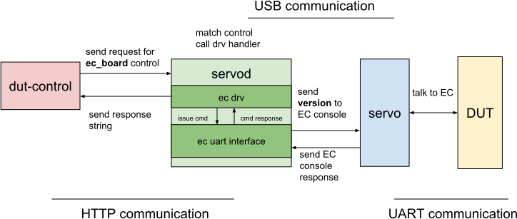

# Servod Overview

This is intended to give a brief overview of how the servo code works, enabling
developers to quickly make additions, and improve the servo framework.

[TOC]

## Installation

To build your changes to `servod` (board overlays, python code, etc), run the
following command:

```bash
(HOST) $ build-servod
```

You can run it by adding the local tag with your normal launch arguments
following it. For instance:

```bash
(HOST) $ start-servod -c local [...]
```

## Testing Your Changes
### Unit Tests

To run unit tests on the hdctools on the local changes you can do the following:
```bash
(HOST) $ run-servod-tests -c local
```

### Running Servod Manually
Make sure your host machine has a servo plugged in. The HOST port should have a
usb connecting it to your dev machine, and the SERVO port should be connected
to your DUT.

If everything is connected correctly, then `lsusb` should have new additions.
Something like `Google Inc. Servo V4` and `Google Cr50`.

If those entries are missing, that might be beacuse of any of the following
reasons:
- The power cable isn't connected to DUT power
- USB-C to DUT or HOST is flipped in the wrong direction
- The servo is plugged into the wrong DUT port (even in the wrong port, ethernet
and power works for the DUT)

Then start servod via this command:
```bash
(HOST) $ start-servod -b lulu
```
Adding a `-s` flag allows you to specify the serial number of your servo.

Servod is typically controlled via various `dut-control` commands.
In a separate terminal, while servod is running, try running the following:
```bash
(HOST) $ dut-control -- power_state:off
(HOST) $ dut-control -- power_state:on
```

Most features of servod are accessed this way by the user.
`dut-control` lets the user access servo features that are exposed via xml config files, in `servo/data`.
Config files can be specified for various hardware components, features and DUTs.

## Contributing changes

Servo code is located in `src/third_party/hdctools` in the cros repo.

After making your changes, to create a CL, run the following command:
```bash
(HOST) $ repo upload --cbr .
```

## Terminology

*   config file

    `.xml` files that outline what controls a servod instance will expose. These
    can be found inside `data/`. [Example][2].

*   `drv`

    The drivers used to execute controls. [Example][17].

    ```xml
      <control>
        <name>ppvar_vbat_ma</name>
        <doc>milliamps being consumed (discharging/positive) or
        supplied (charging/negative) to the battery</doc>
        <params cmd="get" subtype="milliamps" interface="10" drv="ec">
        </params>
      </control>
    ```

*   `control`

    A control - like `ppvar_vbat_ma` - is defined in a configuration file and
    executes code on invocation through dut-control or an RPC proxy. `

*   `params`

    Params are a dictionary of parameters that controls are defined with, and
    are used to execute the control. The params list is passed to the drv on
    initialization for a specific control.

*   `interface`

    The interface describes what interface the drv should use to execute a
    control. Some important interfaces are: 8 == AP console, and 10 == EC
    console.

*   `map`

    In the servod world a `<map>` is used to map a human readable name to a
    numerical value. E.g. the "`onoff`" map defines on = 1 and off = 0.

## System overview

The servo framework works by having a servod instance (a server to process
requests) running and executing controls with the help of physical servo devices
(v2, v4 etc).

The `servod` instance is invoked with a couple of implicit configuration files
(like `common.xml`) and some explicit configuration files (like when invoking
(HOST) $ start-servod -b lulu -- -c lulu_r2.xml`). These configuration files define the
controls this servod instance can handle, and configure how to execute them.

### What happens when we type dut-control ec_board (birds-eye view):

The following graphic shows how a call to `dut-control ec_board` works.



1.  The `dut-control` control issues a request to the servo server, asking it to
    get the control `ec_board`.

1.  The servod [instance][14] then looks up what the control `ec_board` means,
    and how to execute it. It uses its [system config][15] to find the `drv` and
    the params used to execute an `ec_board` request.

1.  The server initializes and keeps around an ec `drv` instance to execute the
    `ec_board` control.

<!-- mdformat off(b/139308852) -->
    *** note
    Note: This is crucial, because it means that one can share state between
    two invocations of `ec_board` - since they use the same `drv` instance to
    execute them - but not as easily between two invocations of different
    controls, since they will use different `drv` instances to execute.
    ***
<!-- mdformat on -->

1.  The server then dispatches an attempt to retrieve the information by calling
    `.get()` on the `drv`.

1.  The return value then gets propagated all the way back up until finally
    `dut-control` prints out the response on the terminal.

## Data and Configuration file structure

A configuration file is an xml file that has `<control>`, `<map>`, and
`<include>` elements as top level tags.

*   `<control>` [elements][2]

    These elements define what you would use for `dut-control`. They are for
    instance `pwr_button`, `ec_board`, etc.

    `<control>` elements can have the following subtags:

    *   `<name>`: Defines the control’s name. _required_.
    *   `<doc>`: A docstring to display.
    *   `<alias>`: Alias is another name to use for this control.
    *   `<params>`: Params used to instantiate a driver.

        This allows for generic drivers that get the information they need
        passed through by the params dictionary. _required_. See more below.

<!-- mdformat off(b/139308852) -->
    *** note
    Note: two params may be defined if the params for the `set` version of the
    control is different from the `get` version of the control. In that case,
    the params are required to have a `cmd` attribute each, one defined as
    `get` the other defined as `set` to [distinguish between them][1].
    ***
<!-- mdformat on -->

*   `<include>` [elements][3]

    These elements indicate a config file to source before this config file.
    They only have one subtag, `<name>` with the config file name.

*   `<map>` [elements][4]

    These elements are string to numerical value mappings that can be used when
    setting a control. When the user calls `pwr_button:press`, there is a config
    file loaded into the servod instance that [defines a map][5] to map `press`
    to a numerical value. The [`pwr_button` control][6] uses that map in its
    params.

    Maps use a `<name>` tag to indicate their name, and _one_ `<params>` tag to
    configure the transformations.

## Drv structure

`drv` (drivers) are classes used to perform the actions listed out in the
configuration file. These drivers handle low level communication, and execution
of the control.

[HwDriver][7] is the source of all drivers, and needs to be inherited from when
building out a new driver. It contains the logic for calling the
`_Set_|control_name|` of a derived class when a control with a subtype is
defined.


Take a look at [the doc][22] for more details on `drv`.

## Interfaces and their usage

Interfaces are what get passed to a driver to use for control execution. These
can either be real interfaces, or the servod instance, if
[`interface="servo"`][9] is defined in the params.

Inside [servo_interfaces.py][10] one can see all the interfaces defined for each
servo type (v2, v4, ccd, etc). The interface index in the list is what the
interface attribute in the params dictionary specifies.

The driver needs to know what interface it is expecting in order to meaningfully
execute a control.

## Params

In general, params can be any parameters that the config file writer decides to
add that are needed for a driver. However, there are a couple special parameters
that one should be aware of. Please take a look [here][params].\
In short: a control needs to provide `drv` and `interface` in the params at a
minimum to function correctly.

## Servo type specific behavior.

There are two mechanism in servod to allow for controls to have different
configurations depending on the type of servo device used: type specific drivers
and interfaces in the control's configuration.

A control can specify a more specific interface or drv instead of using the
global `interface` and `drv` params its params dictionary for a specific servo
type. This would look like `servo_micro_interface` and `servo_micro_drv` These
params would be used in a servo_micro servod instance before the general
`interface` and `drv` params, but ignored in a non servo_micro instance. Take a
look at [`ftdi_common.py`][20] to see the exact name strings.

# Servod Helpers

## Servo Parsing

There are two types of servod parsings: parsing for a client (e.g. dut-control)
and parsing for servod itself. Additionally servod supports runtime
configurations using a config file, to map serialname to symbolic name.

`servod -b samus -s xxx-yyy -> servod -n my_samus //where servodrc has my_samus,
xxx-yyy`

With that, there are some helpers to make parsing easier and more unified. The
purpose is for shared arguments and shared parsing logic (e.g. runtime
configuration mappings) to live in one place, to ensure a consistent cmdline
experience across servod tools, and to simplify and centralize future changes.
Please see [this top comment][21] for an overview and the [servodrc examples].

## Servodtool {#servod-tool}

[`servodtool`][18] is a cmdline tool (and library) to manage `servod` instances
and devices. It's the command-line entry point for tools inside servo/tools.

### device tool

The device tool uses mainly the usb\_hierarchy utility to provide query
functions around the physical servo devices. So far, it provides a tool to find
the /sys/bus/usb/devices/ path of a servo device given its serialname.

### instance tool

The instance tool uses the file-system to leave information around about running
servod instances. It supports listing all instances running on a system and
their info (e.g., what port they run on, what the main process' PID is, what the
serial numbers of the attached servo devices are), and gracefully stopping an
instance.

It works by writing all the information into a file at `/run/servoscratch` on
invocation and clearing out the entry when `servod` turns off. This flow is
supported for almost all methods of turning off `servod`: `Ctrl-C`, `servodtool
instance stop`, or sending a `SIGTERM` to the main process.

Should it become necessary for `servod` to be killed using `SIGKILL`, `servod`
cannot perform a clean-up and stale entries will be left around. On each usage
of `servodtool instance`, or invocation of `servod`, the system attempts to
clean out stale entries.

The inverse is also problematic: should it for some reason become necessary to
delete `/run/servoscratch`, then existing instances are not tracked. For this,
`servodtool instance rebuild` provides a way to try and rebuild lost entries.

## ServoDeviceWatchdog {#servo-device-watchdog}

[`ServoDeviceWatchdog`][19] is a thread that regularly polls to ensure all
devices that a `servod` instance started with are still connected. Should this
not be the case, it will issue a signal to the `servod` instance to turn itself
off.

The one exeption here is `ccd`: for ccd as it is hosted by GSC, the watchdog
allows for a reinit period, where if the connection to GSC is lost (GSC
reboot, cable unplug, etc) and the device is found again within the timeout
period, the interface is reinitialized. Controls issued during the
reinitalization phase will block until the interface is reinitialized.

[1]: ../servo/system_config.py#220
[2]: ../servo/data/ec_common.xml
[3]: ../servo/data/servo_glados_overlay.xml#2
[4]: ../servo/data/common.xml
[5]: ../servo/data/common.xml#95
[6]: ../servo/data/servo_micro.xml#194
[7]: ../servo/drv/hw_driver.py#38
[8]: ../servo/drv/pty_driver.py
[9]: ../servo/data/arm_ec_common.xml#14
[10]: ../servo/servo_interfaces.py
[14]: ../servo/servo_server.py#52
[15]: ../servo/system_config.py#19
[16]: ./servod_faq.md#reroute-control
[17]: ../servo/drv/ec.py
[18]: ../servo/servodtool.py
[19]: ../servo/servod.py#69
[20]: ../servo/ftdi_common.py#28
[21]: ../servo/servo_parsing.py#16
[22]: ./servod_drv.md
[params]: ./servod_drv.md#params
[servodrc examples]: ./servo.md#servodrc
