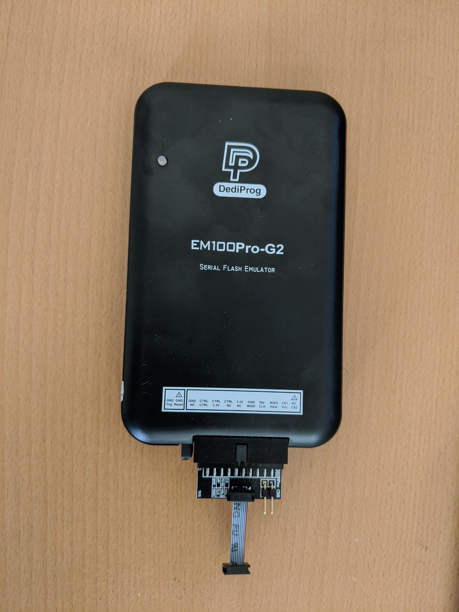

# Using EM100 with C2D2

## Tested Hardware Setup

* EM100Pro-G2 - [EM100Pro-G2]
* SO8 1.27mm 2x4 Adaptor - [EM-PRO-CON-SO8] comes with the entire kit.
* 1.27mm 2x4 to 1.27mm 2x4 cable 2.5cm - [CB-24-127-2.5cm]. If not available
  try the regular length cable.



Note: The arrow mark near the 1st Pin on the adaptor should align with the faint
arrow mark near the 1st Pin on the cable head.

## Baseline EM100 FPGA version

The procedure listed below have been verified with EM100 FPGA version `2.041` or
later. On any prior FPGA version, the device under test (DUT) does not boot due
to signal integrity issues.

## Software Setup

* Prerequisites - Install libusb & curl
    ```bash
    sudo apt-get install libusb-1.0
    sudo apt-get install libcurl4-openssl-dev
    ```
* Get EM100 source
    ```bash
    cd ~
    git clone http://review.coreboot.org/em100.git
    ```
* Compile the EM100 source
    ```bash
    cd ~/em100
    make
    ```

## Preparing BIOS Image

There are 2 methods to prepare the BIOS image.

### Method1

This method works on Intel & AMD platforms and configures the SPI flash speed to
17MHz.

* Build the BIOS image with `USE=”em100-mode”`.

### Method2

This method applies only to Intel platforms.

* Build the BIOS image in the regular way. Use ifdtool to lower the SPI flash
  speed.

  `sudo ifdtool -p <platform> --em100 <path_to_BIOS_image>`
* For Dedede platform=‘jsl’, Deltaur platform=‘tgl’, Brya platform=‘adl’.
* A new BIOS image is prepared in the same path as the input BIOS image with
  ‘.new’ extension.

## Flashing the BIOS Image and tracing

* Connect [em100] to the C2D2 header on the DUT.
* Start servod (optional - use only if access to AP console is required).
```bash
(HOST) $ start-servod -- -b <variant_board>
```
* Flash and Emulate.
    ```bash
    cd ~/em100
    sudo ./em100 -s -c <chip> -d <path_to_prepared_BIOS_image> -v -p LOW -r
    ```
    -c <chip> option varies based on the SPI ROM chip to emulate. Refer to
    the concerned board details to get the chip information.

    -t option can be passed to trace while emulating the SPI ROM

    Note: For SPI ROM parts operating at 1.8 V, passing voltage option
    explicitly using `-V 1.8` may cause some issues. EM100 has been smart enough
    to choose the voltage based on the SPI ROM being emulated and it is better
    to not specify it.
* Rebooting the device will boot AP out of EM100.

[EM100Pro-G2]: https://www.dediprog.com/product/EM100Pro-G2
[EM-PRO-CON-SO8]: https://www.dediprog.com/product/EM-PRO-CON-SO8
[CB-24-127-2.5cm]: https://www.dediprog.com/product/CB-24-127-2.5cm
[em100]: #tested-hardware-setup
