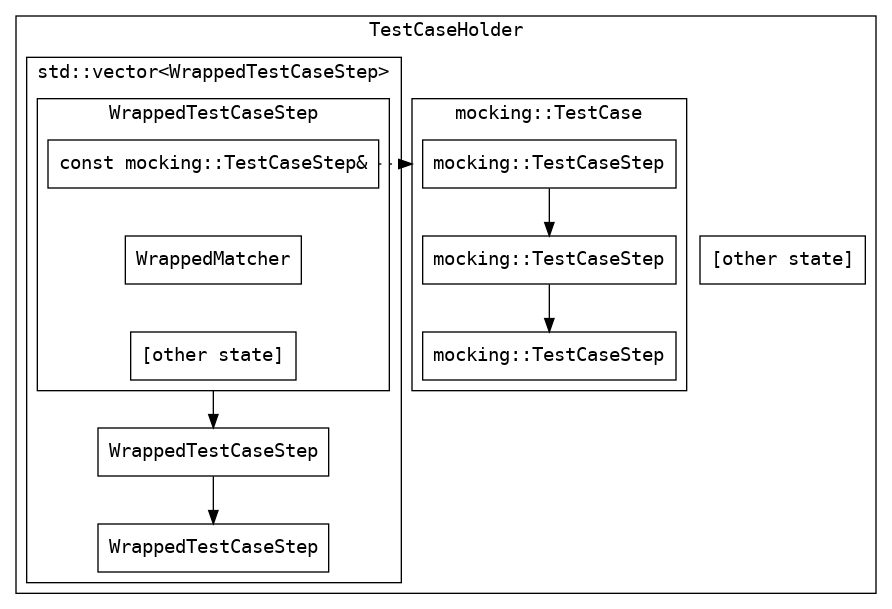

# Mock Printer Mode

Test cases in mock printer mode are built from
[control flow Protobufs](./proto/control_flow.proto). The appendices
in this documentation provide some examples of their mechanics.

Much of this document intermingles usage and maintenance notes. Casual
users need not read this document in detail: try reading an existing
test first and following it by example. Return to this document if you
seek greater depth.

*** aside
TODO(b/178649877): document the command-line flag that will cause
`virtual-usb-printer` to enter mock printer mode.
***

*** aside
TODO(b/178649877): document the general usage of mock printer mode.
***

## Terminology

*   *Test case* - a series of steps that verify at least (and hopefully
    at most) one particular behavior of the Chromium OS printing stack.
*   *Test case step* - a cluster of expectations and at most one
    response. In prose, "`virtual-usb-printer` expects some of events A,
    B, and C; when the expectation is met, `virtual-usb-printer`
    responds with response D."
*   *Matcher* - an expression that defines how an expectation is met.
    For example, "Expectation X is met when `virtual-usb-printer`
    receives message with contents A, B, and C."

*** promo
Mock printer mode will only support building matchers for IPP messages
in the near term.
***

Test case steps (`TestCaseStep`s) have some additional associated terms:

*   *Progression* - a test case step makes _progress_ when
    `virtual-usb-printer` receives a message that matches some
    expectation of said step. `virtual-usb-printer` marks the particular
    expectation as met, thereby progressing the test case step.
*   *Fulfillment* - a test case step is _fulfilled_ when
    `virtual-usb-printer` has received enough messages s.t. said step
    could be considered complete.
*   *Saturation* - a test case step is _saturated_ when
    `virtual-usb-printer` cannot match any more expectations against it
    without exceeding the specified `Cardinality::Count`; the test case
    step is forbidden from progressing further.
*   *Reachable* - a test case step is _reachable_ when it is eligible
    for progression. For example, the "current" test case step is always
    trivially reachable.

*** aside
Fulfillment and saturation are always synonymous when the test case step
has `Cardinality::Type::{ALL_IN_ORDER,ALL_IN_ANY_ORDER}`: _all_ given
expectations must be met, fulfilling and saturating the step
simultaneously. They can diverge for
`Cardinality::Type::{SOME_OF,REPEATED}`, depending on the associated
`Cardinality::Count`.
***

## Source Code Layout

*   `proto/` - defines Protobuf representations of test cases: control
    flow, matchers, and responses.
*   `ipp_matching_validation.h` - used to verify that the IPP
    message Protobufs used as matchers are well-formed.
*   `ipp_matching.h` - used to match `mocking::IppMessage` Protobufs
    with incoming `ipp::Request` messages (received by libipp).
*   `parse_textproto.h` - declares functions for parsing the Protobufs
    defined in the `proto/` subdirectory.
*   `test_case_holder.h` - defines the container in which
    `virtual-usb-printer` holds given test cases. See the diagram below.
    *   `cardinality_helper.h` - defines an abstract class that allows
        callers to progress control flow.
    *   `wrapped_matcher.h` - defines a mock-friendly way to call
        matcher functions for test case steps.

### TestCaseHolder Layout

The `TestCaseHolder` is the top-level container for
`mocking::TestCase`s.

*   The `TestCaseHolder` tracks the overall progression of the
    `TestCase`, including what `TestCaseStep`s are reachable.
*   The `WrappedTestCaseStep` tracks the progression of a single
    `mocking::TestCaseStep`, including which
    `mocking::ExpectationWithResponse`s have been fulfilled.
    *   `WrappedTestCaseStep` contains a `WrappedMatcher`, which is an
        injection-friendly wrapper for matching functions (like those
        in `ipp_matching.h`).

## Appendices

*   [TestCase Flow](./doc/appendix-testcase-flow.md) - describes how
    `virtual-usb-printer` progresses through a given
    `mocking::TestCase`.
*   [TestCaseStep With Multiple Expectations](./doc/appendix-testcasestep-with-multiple-expectations.md) -
    details some minutiae on how `virtual-usb-printer` reasons through
    individual `mocking::TestCaseStep`s when more than one
    `mocking::ExpectationWithResponse` is given.
