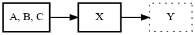
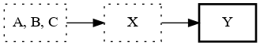
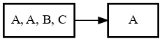

# Appendix: TestCase Flow

`virtual-usb-printer` takes a `TestCase` and reads out the sequence of
`TestCaseStep`s. `virtual-usb-printer` maintains

*   The current test case step. This is the oldest step that is not
    saturated (though it might be fulfilled).
*   Some number of reachable test case steps. Excluding the
    always-reachable current test case step, there may be zero or more
    future test case steps that are also reachable. This is determined
    by the `Cardinality` of each test case step.

## Basic Reachability Example

Given a `TestCase`:

```none
steps {
  cardinality {
    type: SOME_OF
    count { at_most: 3 }
  }
  expectation_with_response { # A }
  expectation_with_response { # B }
  expectation_with_response { # C }
}
steps {
  cardinality {
    type: ALL_IN_ORDER
  }
  expectation_with_response { # X }
}
steps {
  cardinality {
    type: ALL_IN_ORDER
  }
  expectation_with_response { # Y }
}
```

Then the starting state of the test case in `virtual-usb-printer` looks
like this:



*   The _current_ step is the first one (`A`, `B`, or `C`).
*   The second step (expecting `X`) is reachable.
*   The third step (expecting `Y`) is _not_ reachable.

If `virtual-usb-printer` then receives a message matching `X`, then

*   The second step (expecting `X`) would match and be progressed.
*   The second step would be both fulfilled and saturated.
*   The current step would change to be the third (expecting `Y`).



## Reachability Example: Laziness

`virtual-usb-printer` takes a lazy approach to progressing test case
steps. It will always try to progress the oldest non-saturated test case
step (starting with the current one), even if other reachable steps may
match.

Given a `TestCase`:

```none
steps {
  cardinality {
    type: SOME_OF
    count { at_most: 3 }
  }
  expectation_with_response { # A }
  expectation_with_response { # A }
  expectation_with_response { # B }
  expectation_with_response { # C }
}
steps {
  cardinality {
    type: ALL_IN_ORDER
  }
  expectation_with_response { # A }
}
```

Then the starting state of the test case in `virtual-usb-printer` looks
like this:



Although step two is _reachable_, `virtual-usb-printer` will only
progress it if

*   either step 1 saturates (e.g. `B, A, C` arrive in succession) or
*   three `A` messages arrive in succession, _not_ saturating step 1,
    but making the second step the only reachable matcher that can
    accept an `A` message.
