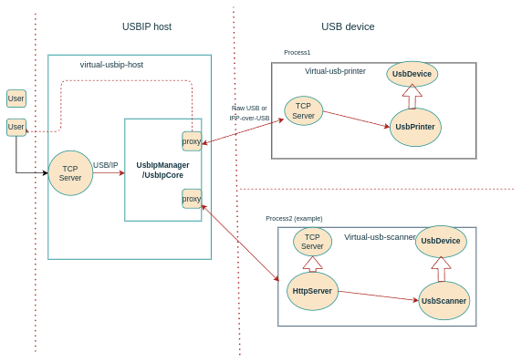
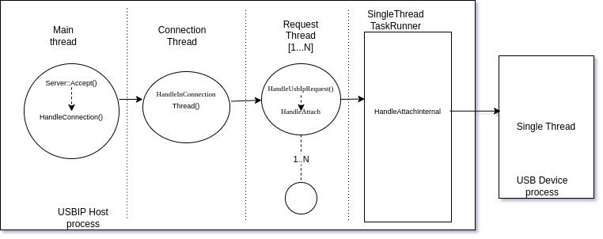

# - Virtual USB Device

`virtual-usb-device` is a framework to create any software based usb device. As of now,
usb printer is created using this framework.
New virtual usb devices can be created by providing  device specific implementations.

## Motivation

Before, there was a virtual-usb-printer component which emulated a usb printer
using USB/IP and IPP-over-USB protocol. The older design was monolithic, non-scalable, single threaded, blocking and inflexible with the newer requirement. This motivated to create a new framework to sort out these limitations.

## How it works

Virtual usb devices can be attached to a system using USB/IP protocol. Once attached, devices act as if they were physically connected to a USB port and thus all the USB access are seamless.
To create a new software based usb device, you need to override the `UsbDevice` interface and implement device-specific functionality.

## Design

The virtual-usb-device is a multi-process framework. It has a single `USBIP Host` process and at least one `USB device` process.

**USBIP host process:**
It provides a server which listens on a fixed port (default: 3240) for the USB/IP messages and allows usb devices to be listed and attached.
Client communicates with this server by sending a usbip message and attaches the usb devices. Once attached, usb device access is seamless compared to real hardware devices.

Internally, it parses usbip messages, strips actual usb commands and communicates with the device processes to get responses back for the usb commands.
UsbIp Host is stateless and doesn't store any of usb device related information(other than port).

UsbIp Host is multi-threaded and thus supports parallel processing of requests i.e multiple clients can interact simulatenously with the server.

**USB device process:**
Each device run in a separate process. It has a server which listens for any USB request sent by `USBIP Host` process, takes action as per request and responds back to the `USBIP host`. This is where any usb operations are processed.

Once started, usb device process registers device information (e.g port) with the `USBIP host` and upon termination, the host takes care of cleaning that data.

[Application] <-- USB/IP --> [USBIP Host process] <--USB requests--> [USB device process]



### Threading model
USBIP host is multi-threaded to support parallel processing of requests.
- Main thread: Runs a server which listens for usbip requests.
- Connection Thread : Manages request threads.
- Request Thread : Created per requests and disposed once requests are served.
- UsbIpCore task runner : single threaded, serially processes the requests.

Note: Each usb device process is single threaded to support serial processing of usb commands.




## Virtual USB Printer
As of now, two usb printer (`raw_printer` and `usb_printer`) is implemented using this framework and used by ChromeOS Tast tests to tests printing stack.

> Older virtual-usb-printer is deprecated now.

## Creating new usb device.
Each usb device is new executable and following steps can be followed to add new device:
- Create a new directory with device name in`virtual_usb_device/usb_device/` and source files(.h/.cc).
   - e.g `virtual_usb_device/usb_device/<custom_usb_device>/custom_usb_device.cc`
- Create a new device class(e.g `CustomUsbDevice`) which inherit from `UsbDevice` class.
- Override any device specific implementation. e.g `HandleGetDeviceId` could returns it's own device Id.
   - Note: `UsbDevice` have default implementation for most of usb command, so only device specific functionality should be overriden.
- Add a main function to create an object of custom usb device.
- You can launch you device binary after host is launched and try to list, attach, detach using `usbip` commands.

> An example of `raw_printer.h/cc` or `usb_printer.h/cc` can be followed for hint.


## Installation

If for some reason you need to build it yourself, you can `USE=usbip`
when building packages for your board - i.e.

```
USE="usbip" ./build_packages --board=$BOARD
```

## Developer guide:

*** note
`virtual-usb-device` relies on `usbip` to manifest as a virtual USB device.
Most test images seem to come with this built-in by default. If you need
to build your own kernel with `usbip` support, make sure to build with
`CONFIG_USBIP_CORE` and `CONFIG_USBIP_VHCI_HCD`.
***

### Command to build locally and deploy:

In development environment:
```
cros_sdk cros_workon_make --board=$BOARD  virtual-usb-printer --install

// Launch vm:
cros vm --start --board=$BOARD --image-path=./src/build/images/amd64-generic/R119-15614.0.0-d2023_11_02_202120-a1/chromiumos_test_image.bin

// deploy into vm
cros deploy localhost:9222 virtual-usb-printer
```

In VM or DUT:

```
// Load vhci_hcd kernel module
amd64-generic ~ # modprobe vhci_hcd

// RUN usbip host
amd64-generic ~ # /usr/local/bin/virtual-usbip-host --port=3240 &

// Device 1 : RUN printer with port 3241
amd64-generic ~ # /usr/local/bin/virtual-rawprinter --descriptors_path=/usr/local/etc/virtual-usb-printer/usb_printer.json  --record_doc_path=/tmp  --host_port=3240 --port=3241 &

// Device 2 : RUN IPP printer with port 3242
amd64-generic ~ # /usr/local/bin/virtual-printer --descriptors_path=/usr/local/etc/virtual-usb-printer/usb_printer.json  ----attributes_path=/usr/local/etc/virtual-usb-printer/ipp_attributes.json--record_doc_path=/tmp  --host_port=3240 --port=3242 &

OR

Single script `virtual-usb-printer.sh` can be used to set up both processes. The argument should be passed as above.
e.g:
/usr/local/bin/virtual-usb-printer.sh --descriptors_path=/usr/local/etc/virtual-usb-printer/ippusb_printer.json  --attributes_path=/usr/local/etc/virtual-usb-printer/ipp_attributes.json --record_doc_path=/usr/local/tmp/tast/run_tmp/tast/printer.PrintIPPUSB.74635040/record.pdf --host_port=3240 --port=3241
```

// After setup, usbip usbip commands can be used to query and attach any usb devices.

```
amd64-generic ~ # usbip list -r 127.0.0.1
    > Exportable USB devices
      ======================
      - 127.0.0.1
        1-1: unknown vendor : unknown product (18d1:505e)
           : /sys/devices/pci0000:00/0000:00:01.2/usb1/3241
           : (Defined at Interface level) (00/00/00)
           :  0 - unknown class / unknown subclass / unknown protocol (07/01/04)
           :  1 - unknown class / unknown subclass / unknown protocol (02/ff/07)

amd64-generic ~ # usbip attach -r 127.0.0.1 -b 1-7

amd64-generic ~ # lsusb
    > Bus 003 Device 001: ID 1d6b:0003 Linux Foundation 3.0 root hub
      Bus 002 Device 013: ID 18d1:505e Google Inc. Virtual USB Printer
      Bus 002 Device 012: ID 18d1:505e Google Inc. Virtual USB Printer
      Bus 002 Device 001: ID 1d6b:0002 Linux Foundation 2.0 root hub

amd64-generic ~ # usbip port
      Imported USB devices
      ====================
      Port 00: <Port in Use> at High Speed(480Mbps)
            unknown vendor : unknown product (18d1:505e)
                    2-1 -> usbip://127.0.0.1:3240/1-1
                               -> remote bus/dev 001/001

amd64-generic ~ # usbip detach -p 00  // port number taken from `usbip port` output
      usbip: info: Port 0 is now detached!

```

*** promo
`virtual-printer` can behave like
*   a printer,
*   an eSCL scanner, or
*   a [scriptable mock printer](./mock_printer/README.md).
***

## Configuration

Configurations are provided via command line argument as JSON file.
Example configurations can be found in the `config/` directory.

The configuration files can be loaded with the following flags:

+ `--descriptors_path` - full path to the JSON file which defines the USB
  descriptors
+ `--attributes_path` - full path to the JSON file which defines the supported
  IPP attributes.
+ `--scanner_capabilities_path` - full path to the JSON file that defines escl based scanner capabilities.
+ `--record_doc_path` - full path to the file used to record documents received from print jobs.

Other command line parameters:

+ `--output_log_dir` - directory path specifying where scan settings will be logged
+ `--mock_printer_script` - Path to script file use to mock printer reponses.
+ `--http_header_output_dir` - Path where http header information and written for logging purpose.
+ `--host_port` -  Port number on which the usbip host is listening on.
+ `--port` - Port number on which a device process is listening.

## Using in Tast

Existing Tast tests can be run as before :
```
tast run 127.0.0.1:9222 printer.PrintUSB
tast run 127.0.0.1:9222 printer.*
tast run 127.0.0.1:9222 scanner.*
```
### Print Tests

+ [printer.AddUSBPrinter](https://source.chromium.org/chromiumos/chromiumos/codesearch/+/main:src/platform/tast-tests/src/chromiumos/tast/local/bundles/cros/printer/add_usb_printer.go)
  + Tests that adding a basic USB printer works correctly
+ [printer.PrintUSB](https://source.chromium.org/chromiumos/chromiumos/codesearch/+/main:src/platform/tast-tests/src/chromiumos/tast/local/bundles/cros/printer/print_usb.go)
  + Tests that the full print pipeline works correctly for a basic USB printer
+ [printer.PrintIPPUSB](https://source.chromium.org/chromiumos/chromiumos/codesearch/+/main:src/platform/tast-tests/src/chromiumos/tast/local/bundles/cros/printer/print_ippusb.go)
  + Tests that the full print pipeline for IPP-over-USB printing works correctly
  + This also tests that the [automatic\_usb\_printer\_configurer](https://source.chromium.org/chromium/chromium/src/+/main:chrome/browser/chromeos/printing/automatic_usb_printer_configurer.h) is able to automatically configure an IPP Everywhere printer
+ [printer.IPPUSBPPDNoCopies](https://source.chromium.org/chromiumos/chromiumos/codesearch/+/main:src/platform/tast-tests/src/chromiumos/tast/local/bundles/cros/printer/ippusb_ppd_no_copies.go),
  [printer.IPPUSBPPDCopiesUnsupported](https://source.chromium.org/chromiumos/chromiumos/codesearch/+/main:src/platform/tast-tests/src/chromiumos/tast/local/bundles/cros/printer/ippusb_ppd_copies_unsupported.go),
  and
  [printer.IPPUSBPPDCopiesSupported](https://source.chromium.org/chromiumos/chromiumos/codesearch/+/main:src/platform/tast-tests/src/chromiumos/tast/local/bundles/cros/printer/ippusb_ppd_copies_supported.go)
  + Tests that the CUPS understands whether or not printers support
    print job copies (duplication).

### Scan Tests

+ [documentscanapi.Scan](https://source.chromium.org/chromiumos/chromiumos/codesearch/+/main:src/platform/tast-tests/src/chromiumos/tast/local/bundles/cros/documentscanapi/scan.go)
  + Tests the document scanner app.
+ [scanner.EnumerateIPPUSB](https://source.chromium.org/chromiumos/chromiumos/codesearch/+/main:src/platform/tast-tests/src/chromiumos/tast/local/bundles/cros/scanner/enumerate_ipp_usb.go)
  + Tests that
    [lorgnette](https://source.chromium.org/chromiumos/chromiumos/codesearch/+/main:src/platform2/lorgnette/)
    can correctly enumerate IPP USB devices.
+ [scanner.ScanESCLIPP](https://source.chromium.org/chromiumos/chromiumos/codesearch/+/main:src/platform/tast-tests/src/chromiumos/tast/local/bundles/cros/scanner/scan_escl_ipp.go)
  + Tests basic scanning functionality via IPP USB.
